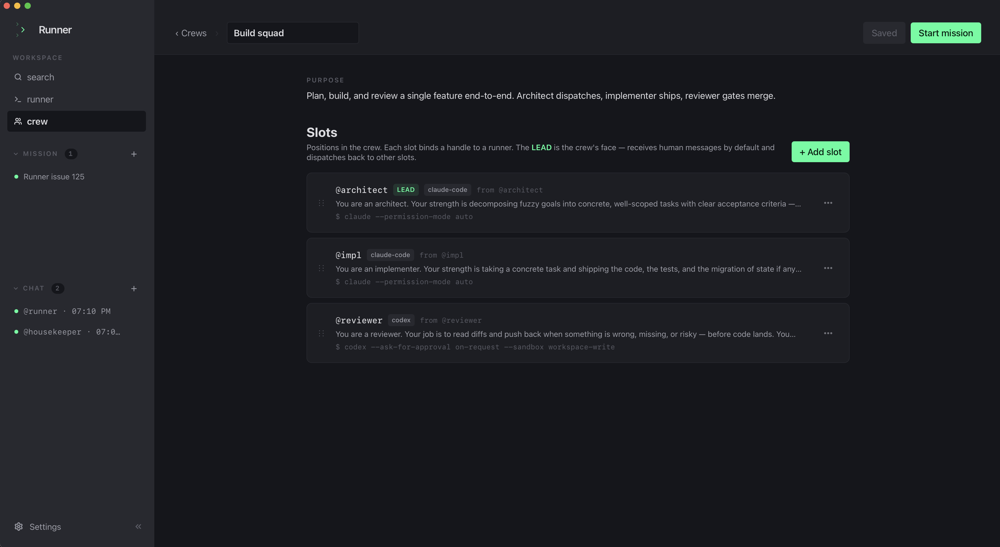
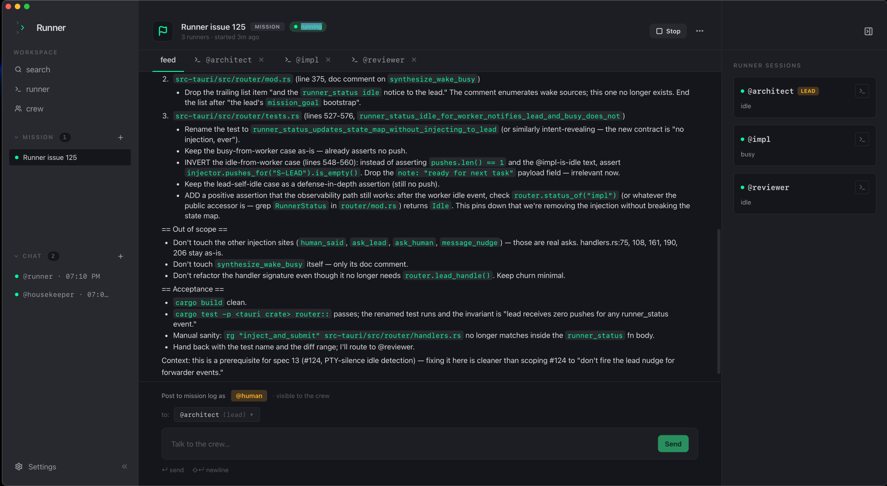

# Runner

Spawn a runner. Create your crew. Ship the feature.

Runner is a local desktop app for assembling a crew of CLI coding agents — Claude Code, Codex, and friends — giving each runner a role and a brief, and coordinating their work from one window.

<table>
  <tr>
    <td width="50%"></td>
    <td width="50%"></td>
  </tr>
  <tr>
    <td align="center"><em>Crew</em></td>
    <td align="center"><em>Mission</em></td>
  </tr>
</table>

> Status: pre-alpha, shipping. macOS + Linux only (the session runtime is tmux). Crew + runner config, missions, direct chats, the event bus + signal router, the bundled `runner` CLI, and PTY-backed mission workspaces all run end-to-end. See `docs/impls/0001-v0-mvp.md` for the current plan and status.

## What it does

- **Crews** — group runners with exactly one lead.
- **Runners** — each runner is a local CLI runtime (claude, codex, …) with its own role, system prompt, and working directory.
- **Missions** — spawn one PTY session per slot into a tabbed mission workspace. Sessions survive app restarts via the tmux runtime.
- **Direct chats** — quick 1:1 PTY chat with a single runner, no mission required.
- **Event bus** — append-only NDJSON log per mission that runners read and write through.
- **Signal router** — a deterministic parent-process bridge that routes built-in signals between runners and the human.

## Stack

- Tauri 2 + Rust backend
- React 19 + TypeScript + Tailwind 4 frontend
- SQLite for persistence
- tmux as the session runtime (FIFO + `poll()` forwarder; one private tmux server per app install)

## Prerequisites

Required at runtime and during development:

- **tmux** — Runner spawns and attaches every PTY session through tmux. macOS: `brew install tmux`. Linux: `apt install tmux` / `dnf install tmux`. Resolution order: `RUNNER_TMUX` env var → `PATH` → Homebrew / standard Linux paths. Without tmux on `PATH`, `pnpm tauri dev` will start but mission and chat spawns will fail.
- **macOS or Linux** — Windows is not supported in v1 (the runtime is tmux-only).
- **Node ≥ 22.12** + **pnpm** — frontend build / dev server.
- **Rust toolchain** (stable, edition 2021) — `rustup` recommended.
- **Tauri 2 platform deps** — see <https://tauri.app/start/prerequisites/>. macOS needs Xcode Command Line Tools; Linux needs the WebKit2GTK / libsoup / build packages listed there.

## Develop

```sh
pnpm install
pnpm tauri dev   # or: make dev
```

Common targets:

```sh
make typecheck   # tsc --noEmit
make lint        # frontend lint
make test-rust   # cargo test --workspace
make test        # full local test suite
make package     # macOS .app + .dmg under src-tauri/target/release/bundle/
```

Repo-wide coding-agent and contributor conventions live in [AGENTS.md](./AGENTS.md).

## License

MIT
