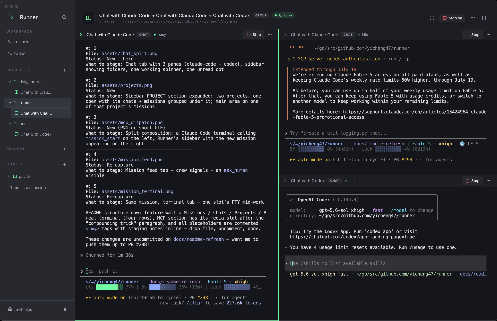

<!-- LOGO -->
<h1 align="center">
  
   
  Runner
</h1>

  Spawn a runner. Create your crew. Ship the feature.
   
  A local agentic development environment (ADE) — orchestrate crews of CLI coding agents: Claude Code, Codex, and friends.

  <a href="#about">About</a>
  ·
  <a href="#features">Features</a>
  ·
  <a href="#drive-it-from-your-agents-mcp">MCP</a>
  ·
  <a href="#example-crew">Crew example</a>
  ·
  <a href="#download">Download</a>
  ·
  <a href="#documentation">Documentation</a>
  ·
  <a href="./AGENTS.md">Contributing</a>

---

> Status: alpha, actively shipping. macOS today; Linux on the way.

---

## About

Runner is what happens when you stop juggling four terminal windows for four AI agents and put them in one workspace instead.

In the vocabulary settling in around this workflow, Runner is an **ADE** — an agentic development environment. Where an IDE arranges buffers and a debugger around code you write, an ADE arranges terminals, crews, and event feeds around agents that write it. You operate the fleet: assign roles, start missions, watch the panes, review the diffs, answer the questions.

You assemble a **Crew** — a small party of CLI agents (Claude Code, Codex, custom shells). You give each runner a role, a system prompt, and a working directory. You hit **Start mission** and Runner forks a real PTY per slot into a tabbed workspace, wires them together through an append-only event bus, and lets you watch the work unfold from one window. When an agent needs you, it fires `ask_human` and the question surfaces in the feed.

Runner is also an **MCP server** — any MCP client can create crews, start missions, and steer them from the outside. See [Drive it from your agents](#drive-it-from-your-agents-mcp).

## Download

Latest macOS build (Apple Silicon + Intel `.dmg`) on the [releases page](https://github.com/yicheng47/runner/releases/latest). Linux builds coming with the v1 cut.

<!-- TODO(demo): add a "## Demo" section here once the new hero video is recorded — a Peer
     Coding Crew mission on a real repo (mission start from a project → feed + per-slot
     terminals → coder/reviewer handoffs via the Runner CLI → ask_human surfacing → done). -->

## Features

<table>
<tr>
<td width="50%" valign="middle">

### Missions — a crew working one goal

**Runners** are reusable agent templates: a CLI runtime plus a role, system prompt, and working directory. **Crews** group them with exactly one lead. A **mission** spawns one live PTY per slot into a tabbed workspace where the crew coordinates over an append-only event log — every signal is persisted and replayable, so missions survive a quit or crash, and `ask_human` questions surface in the feed.

[Architecture →](./docs/arch/arch.md)

</td>
<td width="50%">
  <!-- TODO(screenshot): re-capture at current UI — this shot is from the earliest demo build. -->
  
</td>
</tr>
<tr>
<td width="50%" valign="middle">

### Chats — tabs, split panes, folders

Every chat is a real 1:1 PTY with a runner, no mission required. Tabs hold up to three side-by-side panes — run a Claude Code and a Codex on the same problem in one view. The sidebar groups tabs into collapsible folders; every tab shows a spinner while a pane is still working and a dot when one finished while you were elsewhere, so a wall of parallel agents stays scannable.

</td>
<td width="50%">
  <!-- TODO(screenshot): assets/chat_split.png — the hero shot. One chat tab with three panes
       (claude-code + codex side by side), sidebar visible with PROJECT section, folders,
       one working spinner and one unread dot. Uncomment when captured:
  
  -->
</td>
</tr>
<tr>
<td width="50%" valign="middle">

### A real terminal

xterm.js on a WebGL canvas — claude-code, codex, and any modern TUI render with their actual ANSI palette, mouse tracking, and live redraws. Sessions are resumable across app restarts; the event log is the source of truth.

</td>
<td width="50%">
  <!-- TODO(screenshot): re-capture at current UI — this shot is from the earliest demo build. -->
  
</td>
</tr>
<tr>
<td width="50%" valign="middle">

### Themes

Auto / Light / Dark chrome with two variants per side (Runner and Catppuccin Mocha dark; Codex Light and Catppuccin Latte light), independent terminal palettes (Runner, Catppuccin Mocha, Solarized Dark), and a bundled font picker (Inter / Geist / Roboto / System UI) that works offline.

</td>
<td width="50%">
  <!-- TODO(screenshot): assets/themes.png — 2×2 theme grid: Runner (Carbon), Catppuccin Mocha,
       Codex Light, Catppuccin Latte. Same content in all four, only the palette changes.
       Uncomment when captured:
  
  -->
</td>
</tr>
</table>

### Also in the box

- **Projects** — bind a working directory once; chats and missions started inside a project inherit its cwd and stay grouped in their own sidebar section.
- **Multi-window** — `⌘N` opens additional OS windows; when two windows show the same session, one owns the PTY and the other gets a hand-off overlay instead of a corrupted terminal.
- **Bundled `runner` CLI** — spawned agents message each other, check the crew roster, and post signals from inside their own PTYs.
- **Auto-updates** — new builds ship through the built-in updater.

### Drive it from your agents (MCP)

Everything above is also an MCP tool. Runner bundles a `runner-mcp` stdio sidecar that proxies to the running app — **Settings → MCP** has one-click config snippets for Claude Code and Codex, no URL or args to manage.

Once connected, an agent can operate Runner the way you do:

- `runner_create` / `crew_create` / `slot_create` — define runners and assemble crews.
- `mission_start` — launch a crew at a goal, attached to a project so it inherits the right working directory.
- `mission_feed` / `mission_status` / `mission_post_human_signal` — follow the run and steer it mid-flight.
- `session_start_direct` — spin up a 1:1 chat with any runner.
- `project_list` / `crew_list` / `mission_list_summary` — discover what exists before acting.

The compounding trick: your daily driver agent plans a fix, then calls `mission_start` to hand implementation to a coder/reviewer crew and keeps working — agents dispatching crews of agents, with every session still a real PTY you can open and watch.

## Example crew

The **default Runner shape** — a three-runner engineering party where one decomposes, one builds, one audits. Lives in [`examples/dev-crew/`](./examples/dev-crew/) — drop the system prompts into a new Crew, hand it a goal, and the three tabs work the problem in one window.

| Runner | Runtime | Role | System prompt |
| --- | --- | --- | --- |
| **@architect** (lead) | `claude-code` | Reads the goal, decomposes into tasks, dispatches the rest. Stays out of the editor. | [`architect.md`](./examples/dev-crew/architect.md) |
| **@impl** | `claude-code` | Picks up tasks, writes the code, runs the tests. | [`impl.md`](./examples/dev-crew/impl.md) |
| **@reviewer** | `codex` | Reads the diff, finds regressions and missing edge cases, reports back. | [`reviewer.md`](./examples/dev-crew/reviewer.md) |

### More crews

For weirder, more fun crew shapes, peek at [`examples/`](./examples/):

- [`dev-crew/`](./examples/dev-crew/) — the default architect / impl / reviewer trio above
- [`docs-crew/`](./examples/docs-crew/) — architect partitions a complex repo, 2+ writers draft per-module docs in parallel, editor harmonizes
- [`tic-tac-toe/`](./examples/tic-tac-toe/) — 2 agents + 1 referee actually playing a game against each other
- [`werewolf/`](./examples/werewolf/) — 6-player social deduction with a god moderator
- [`tomb-raid/`](./examples/tomb-raid/) — a 4-person heist crew run by a DM

Each is a copy-pasteable handle + system-prompt set you can spawn into a new Crew and hit Start.

## Documentation

Architecture, runtime contracts, product vision, and per-feature specs live in [`docs/`](./docs/) — start with [`docs/arch/arch.md`](./docs/arch/arch.md) for the wire-level overview, or [`docs/product/vision.md`](./docs/product/vision.md) for the product direction.

For dev setup, prereqs, and contributor conventions see [AGENTS.md](./AGENTS.md).

## License

MIT
