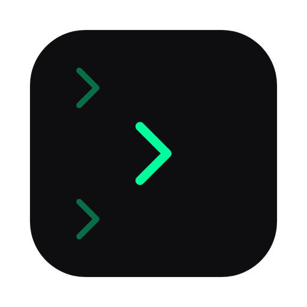
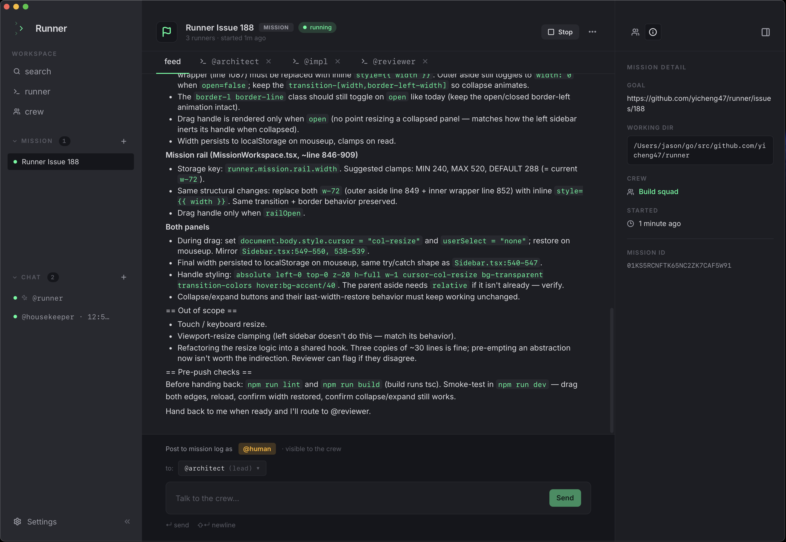
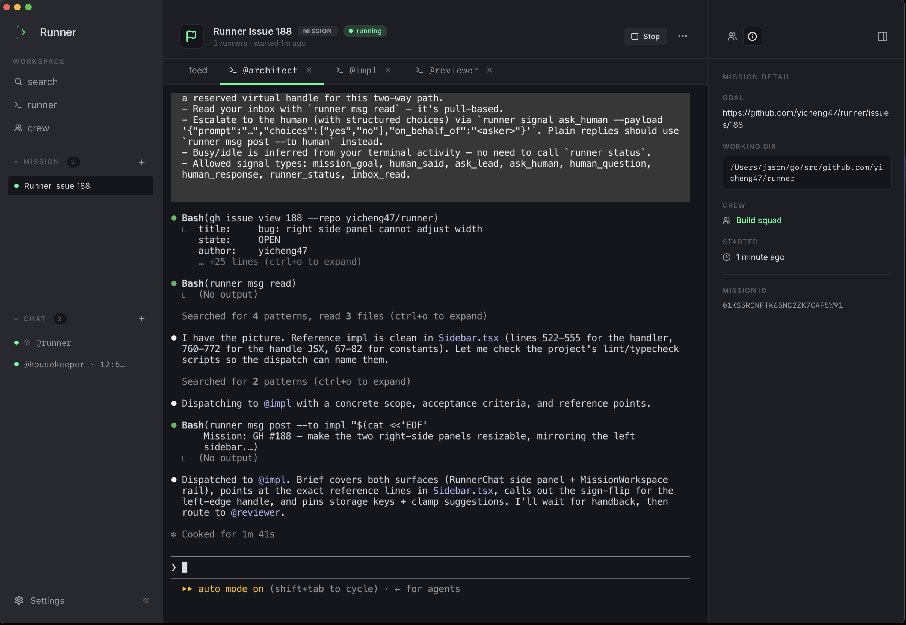

<!-- LOGO -->
<h1 align="center">
  
   
  Runner
</h1>

  Spawn a runner. Create your crew. Ship the feature.
   
  A local desktop app for orchestrating crews of CLI coding agents — Claude Code, Codex, and friends.

  <a href="#about">About</a>
  ·
  <a href="#example-crew">Crew example</a>
  ·
  <a href="#download">Download</a>
  ·
  <a href="#documentation">Documentation</a>
  ·
  <a href="./AGENTS.md">Contributing</a>

---

> Status: pre-alpha, actively shipping. macOS today; Linux on the way.

---

## About

Runner is what happens when you stop juggling four terminal windows for four AI agents and put them in one workspace instead.

You assemble a **Crew** — a small party of CLI agents (Claude Code, Codex, custom shells). You give each runner a role, a system prompt, and a working directory. You hit **Start mission** and Runner forks a real PTY per slot into a tabbed workspace, wires them together through an append-only event bus, and lets you watch the work unfold from one window. When an agent needs you, it fires `ask_human` and the question surfaces in the feed. When you want to talk to a single agent without the orchestration scaffolding, **Direct chat** is a one-click 1:1 PTY.

The terminal is a real xterm.js + WebGL canvas — claude-code, codex, and any modern TUI render with their actual ANSI palette, mouse tracking, and live redraws. Sessions are resumable across app restarts (the event log is the source of truth). Themes are first-class: Auto / Light / Dark across four bundled palettes (Runner, Codex Light, Catppuccin Mocha, Catppuccin Latte) with a bundled font picker (Inter / Geist / Roboto / System UI) that works offline.

## Download

Latest macOS build (Apple Silicon + Intel `.dmg`) on the [releases page](https://github.com/yicheng47/runner/releases/latest). Linux builds coming with the v1 cut.

## Demo

A three-runner crew shipping a tic-tac-toe game end-to-end — `@architect` decomposes the goal, `@impl` writes the code, `@reviewer` reads the diff.

https://github.com/user-attachments/assets/f02e949b-117c-4d44-980a-58a9c76c49fe

## Screenshots

<table>
  <tr>
    <td width="50%"></td>
    <td width="50%"></td>
  </tr>
  <tr>
    <td align="center"><em>Mission feed — every signal between the crew + human</em></td>
    <td align="center"><em>Mission terminal — one PTY per slot, live</em></td>
  </tr>
</table>

## What it does

- **Crews** — group runners with exactly one lead.
- **Runners** — each runner is a local CLI runtime (claude, codex, …) with its own role, system prompt, and working directory.
- **Missions** — spawn one PTY session per slot into a tabbed workspace where the crew works toward a shared goal.
- **Direct chats** — quick 1:1 PTY with a single runner, no mission required.
- **Event feed** — every signal between agents and the human, persisted to disk and replayable so missions resume cleanly after a quit or crash.

For the wire-level architecture (event bus, signal router, runtime contracts) see [`docs/`](./docs/) — start with [`docs/arch/arch.md`](./docs/arch/arch.md).

## Example crew

The crew in the demo above is the **default Runner shape** — a three-runner engineering party where one decomposes, one builds, one audits. Lives in [`examples/dev-crew/`](./examples/dev-crew/) — drop the system prompts into a new Crew, hand it a goal, and the three tabs work the problem in one window.

| Runner | Runtime | Role | System prompt |
| --- | --- | --- | --- |
| **@architect** (lead) | `claude-code` | Reads the goal, decomposes into tasks, dispatches the rest. Stays out of the editor. | [`architect.md`](./examples/dev-crew/architect.md) |
| **@impl** | `claude-code` | Picks up tasks, writes the code, runs the tests. | [`impl.md`](./examples/dev-crew/impl.md) |
| **@reviewer** | `codex` | Reads the diff, finds regressions and missing edge cases, reports back. | [`reviewer.md`](./examples/dev-crew/reviewer.md) |

### More crews

For weirder, more fun crew shapes, peek at [`examples/`](./examples/):

- [`dev-crew/`](./examples/dev-crew/) — the default architect / impl / reviewer trio above
- [`tic-tac-toe/`](./examples/tic-tac-toe/) — 2 agents + 1 referee actually playing a game against each other
- [`werewolf/`](./examples/werewolf/) — 6-player social deduction with a god moderator
- [`tomb-raid/`](./examples/tomb-raid/) — a 4-person heist crew run by a DM

Each is a copy-pasteable handle + system-prompt set you can spawn into a new Crew and hit Start.

## Documentation

Architecture, runtime contracts, product vision, and per-feature specs live in [`docs/`](./docs/) — start with [`docs/arch/arch.md`](./docs/arch/arch.md) for the wire-level overview, or [`docs/product/vision.md`](./docs/product/vision.md) for the product direction.

For dev setup, prereqs, and contributor conventions see [AGENTS.md](./AGENTS.md).

## License

MIT
