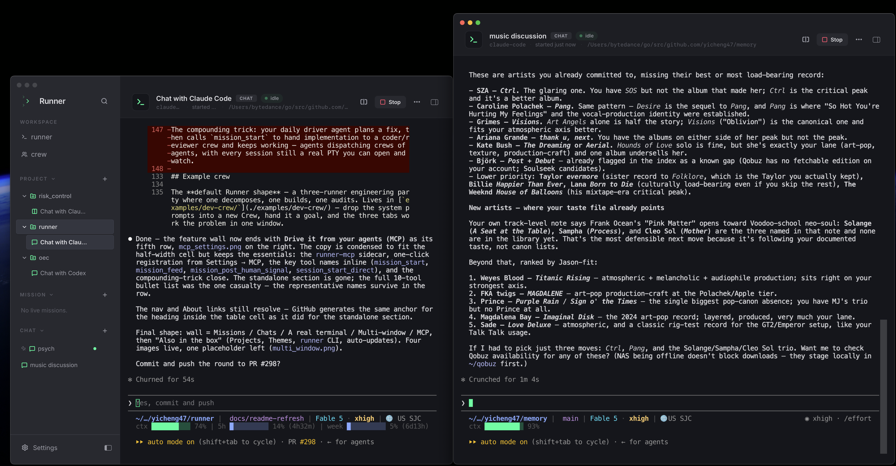
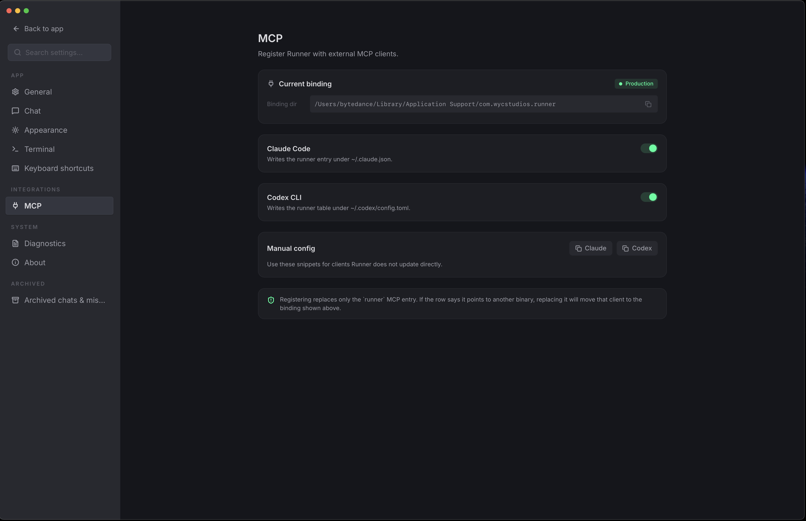

<!-- LOGO -->
<h1 align="center">
  
   
  Runner
</h1>

  Spawn a runner. Create your crew. Ship the feature.
   
  A local agentic development environment (ADE) — orchestrate crews of CLI coding agents: Claude Code, Codex, and friends.

  <a href="#about">About</a>
  ·
  <a href="#features">Features</a>
  ·
  <a href="#drive-it-from-your-agents-mcp">MCP</a>
  ·
  <a href="#example-crew">Crew example</a>
  ·
  <a href="#download">Download</a>
  ·
  <a href="#documentation">Documentation</a>
  ·
  <a href="./AGENTS.md">Contributing</a>

---

> Status: alpha, actively shipping. macOS today; Linux on the way.

---

## About

Runner is a local desktop workspace for operating multiple CLI coding agents at once. Instead of scattering Claude Code and Codex sessions across terminal windows, you run them as an organized fleet — configured runners, composed crews, coordinated missions — from a single app.

Runner is an **agentic development environment (ADE)**. Where an IDE organizes buffers and a debugger around the code you write, an ADE organizes terminals, crews, and event feeds around the agents writing it. The operator's job shifts accordingly: assign roles, start missions, monitor progress, review diffs, and make the calls agents escalate to you.

The coordination model is explicit. A **runner** is a reusable agent configuration — runtime, role, system prompt, working directory. A **crew** composes runners with exactly one lead. Starting a **mission** spawns one real PTY per slot into a tabbed workspace where the crew coordinates over an append-only event log: handoffs and status flow between agents, and when a decision needs a human, `ask_human` surfaces it in the feed. Everything runs and persists locally — sessions are real processes on your machine, and the log is on-disk and replayable.

Runner also runs as an **MCP server**: any MCP client — including the agents themselves — can create crews, start missions, and steer them programmatically. See [Drive it from your agents](#drive-it-from-your-agents-mcp).

## Download

Latest macOS build (Apple Silicon + Intel `.dmg`) on the [releases page](https://github.com/yicheng47/runner/releases/latest). Linux builds coming with the v1 cut.

<!-- TODO(demo): add a "## Demo" section here once the new hero video is recorded — a Peer
     Coding Crew mission on a real repo (mission start from a project → feed + per-slot
     terminals → coder/reviewer handoffs via the Runner CLI → ask_human surfacing → done). -->

## Features

<table>
<tr>
<td width="50%">
  
</td>
<td width="50%" valign="middle">

### Crews — roles, prompts, one lead

A **runner** is a reusable agent configuration: runtime, role, system prompt, working directory. A **crew** composes runners into named slots with exactly one lead, plus team conventions and a definition of done that every mission inherits.

</td>
</tr>
<tr>
<td width="50%">
  
</td>
<td width="50%" valign="middle">

### Missions — a crew working one goal

Starting a mission spawns one live PTY per slot into a tabbed workspace where the crew coordinates over an append-only event log — every signal is persisted and replayable, so missions survive a quit or crash, and `ask_human` questions surface in the feed.

[Architecture →](./docs/arch/arch.md)

</td>
</tr>
<tr>
<td width="50%">
  
</td>
<td width="50%" valign="middle">

### Chats — tabs, split panes, projects

Every chat is a real 1:1 PTY with a runner, no mission required. Tabs hold up to three side-by-side panes — run a Claude Code and a Codex on the same problem in one view. The sidebar groups chats and missions into cwd-bound projects; every tab shows a spinner while a pane is still working and a dot when one finished while you were elsewhere, so a wall of parallel agents stays scannable.

</td>
</tr>
<tr>
<td width="50%">
  
</td>
<td width="50%" valign="middle">

### A real terminal

xterm.js on a WebGL canvas — claude-code, codex, and any modern TUI render with their actual ANSI palette, mouse tracking, and live redraws. Sessions are resumable across app restarts; the event log is the source of truth.

</td>
</tr>
<tr>
<td width="50%">
  
</td>
<td width="50%" valign="middle">

### Multi-window

`⌘N` opens additional OS windows — a mission on one screen, a wall of chats on the other. Windows coordinate ownership of shared sessions: the primary owns the PTY, and any other window showing the same session gets a hand-off overlay instead of a corrupted terminal.

</td>
</tr>
<tr>
<td width="50%">
  
</td>
<td width="50%" valign="middle">

### Drive it from your agents (MCP)

Everything above is also an MCP tool. Runner bundles a `runner-mcp` stdio sidecar, and **Settings → MCP** registers it with Claude Code or Codex in one click. Connected agents assemble crews, start and steer missions (`mission_start`, `mission_feed`, `mission_post_human_signal`), and spin up chats (`session_start_direct`). The compounding trick: your daily driver agent plans a fix, dispatches a coder/reviewer crew, and keeps working — agents dispatching crews of agents, every session still a real PTY you can open and watch.

</td>
</tr>
</table>

### Also in the box

- **Projects** — bind a working directory once; chats and missions started inside a project inherit its cwd and stay grouped in their own sidebar section.
- **Themes** — Auto / Light / Dark chrome with two variants per side (Runner and Catppuccin Mocha dark; Codex Light and Catppuccin Latte light), independent terminal palettes, and a bundled offline font picker.
- **Bundled `runner` CLI** — spawned agents message each other, check the crew roster, and post signals from inside their own PTYs.

## Example crew

The **default Runner shape** — a three-runner engineering party where one decomposes, one builds, one audits. Lives in [`examples/dev-crew/`](./examples/dev-crew/) — drop the system prompts into a new Crew, hand it a goal, and the three tabs work the problem in one window.

| Runner | Runtime | Role | System prompt |
| --- | --- | --- | --- |
| **@architect** (lead) | `claude-code` | Reads the goal, decomposes into tasks, dispatches the rest. Stays out of the editor. | [`architect.md`](./examples/dev-crew/architect.md) |
| **@impl** | `claude-code` | Picks up tasks, writes the code, runs the tests. | [`impl.md`](./examples/dev-crew/impl.md) |
| **@reviewer** | `codex` | Reads the diff, finds regressions and missing edge cases, reports back. | [`reviewer.md`](./examples/dev-crew/reviewer.md) |

### More crews

For weirder, more fun crew shapes, peek at [`examples/`](./examples/):

- [`dev-crew/`](./examples/dev-crew/) — the default architect / impl / reviewer trio above
- [`docs-crew/`](./examples/docs-crew/) — architect partitions a complex repo, 2+ writers draft per-module docs in parallel, editor harmonizes
- [`tic-tac-toe/`](./examples/tic-tac-toe/) — 2 agents + 1 referee actually playing a game against each other
- [`werewolf/`](./examples/werewolf/) — 6-player social deduction with a god moderator
- [`tomb-raid/`](./examples/tomb-raid/) — a 4-person heist crew run by a DM

Each is a copy-pasteable handle + system-prompt set you can spawn into a new Crew and hit Start.

## Documentation

Architecture, runtime contracts, product vision, and per-feature specs live in [`docs/`](./docs/) — start with [`docs/arch/arch.md`](./docs/arch/arch.md) for the wire-level overview, or [`docs/product/vision.md`](./docs/product/vision.md) for the product direction.

For dev setup, prereqs, and contributor conventions see [AGENTS.md](./AGENTS.md).

## License

MIT
