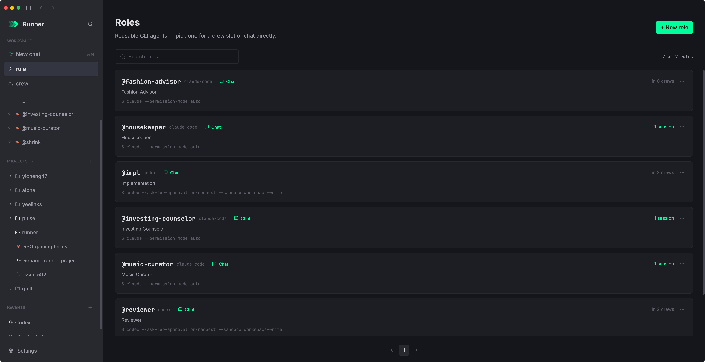
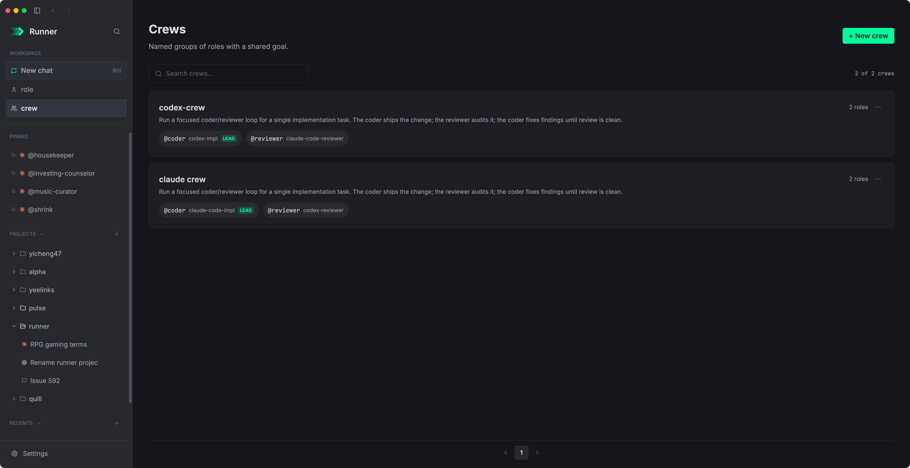
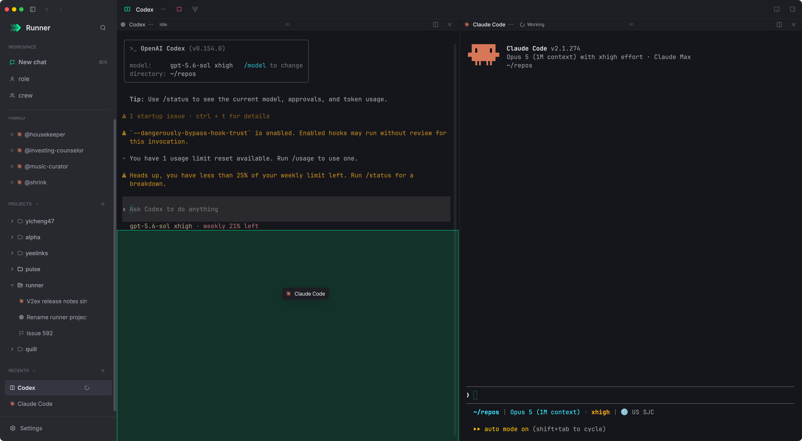
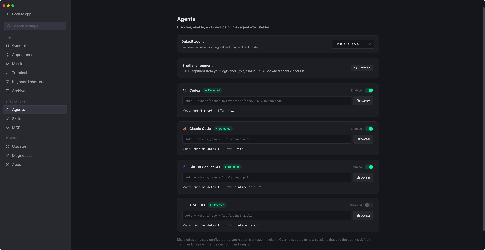

<!-- LOGO -->
<h1 align="center">
  
  <br />
  Runner
</h1>

<p align="center">
  <a href="https://github.com/yicheng47/runner/stargazers"></a>
  <a href="https://github.com/yicheng47/runner/releases"></a>
  <a href="./LICENSE"></a>
  <a href="#community"></a>
  <a href="#download"></a>
</p>

<p align="center">
  English · <a href="./README.zh-CN.md">简体中文</a>
</p>

<p align="center">
  <strong>Write a role. Create your crew. Ship the feature.</strong>
  <br />
  A native terminal that orchestrates coding agents. Claude Code and Codex keep their own TUI; Runner adds sessions, skills, and crews.
</p>

<p align="center">
  <a href="https://github.com/yicheng47/runner/releases/latest"><strong>Download Runner</strong></a>
</p>

<p align="center">
  
</p>

<p align="center">
  <a href="#about">About</a>
  ·
  <a href="#features">Features</a>
  ·
  <a href="#supported-agents">Agents</a>
  ·
  <a href="#mcp-servers-and-skills-managed-in-one-place">MCP</a>
  ·
  <a href="#example-crew">Crew example</a>
  ·
  <a href="#download">Download</a>
  ·
  <a href="#documentation">Documentation</a>
  ·
  <a href="./AGENTS.md">Contributing</a>
</p>

> Status: alpha, actively shipping. Native macOS (Apple Silicon) and Windows (x64), with Windows support starting in 0.8.0.

## About

Runner is a native desktop app for running several CLI coding agents at once. Claude Code and Codex keep their own TUI in a real terminal; Runner is the layer around them.

- **Role** — a reusable agent configuration: runtime, system prompt, working directory.
- **Crew** — roles composed into named slots with one lead, plus the team conventions every mission inherits.
- **Mission** — a crew working one goal: one live terminal per slot, coordinating over an event feed that persists and replays, with `ask_human` when a decision is yours.
- **Chat** — a single agent in a real terminal, no mission required; split a tab as far as the window allows.
- **CLI** — everything above is a command too, so agents, scripts, and people at a terminal can drive Runner themselves.

Written in Rust on [gpui-ce](https://github.com/gpui-ce/gpui-ce), the community fork of [Zed](https://zed.dev)'s GPUI, with `alacritty_terminal` for the grid and SQLite for state. No webview. Everything runs and persists on your machine.

## Download

Grab the latest build from the [releases page](https://github.com/yicheng47/runner/releases/latest): a signed and notarized `.dmg` for macOS on Apple Silicon, and a signed `Runner-Setup-…-x64.exe` installer for Windows 10 version 1809 or later. Intel Macs, Windows ARM64, and Linux are not supported.

Both platforms update in place, macOS through Sparkle and Windows through the update icon beside Settings, and keep your settings, chats, and missions. On Windows, SmartScreen may still warn on a fresh release while the certificate builds reputation; **More info → Run anyway** continues.

Want what landed today instead? The [`nightly` prerelease](https://github.com/yicheng47/runner/releases/tag/nightly) is built from `main` for both platforms, signed the same way, and updates on its own channel.

## Community

- Bugs and feature requests: [GitHub Issues](https://github.com/yicheng47/runner/issues).
- 中文用户可以扫码加入 Runner 微信用户群。群二维码 7 天过期，如果扫码提示失效，请[提一个 issue](https://github.com/yicheng47/runner/issues/new) 提醒我更新。


## Demo

A three-agent crew — two players and a referee — playing a game of tic-tac-toe against each other over the mission feed, from the [`tic-tac-toe`](./examples/tic-tac-toe/) example crew.

https://github.com/user-attachments/assets/fb3669a4-010d-42d0-9555-2a3ba3223c75

## Features

<table>
<tr>
<td width="50%">
  
  
</td>
<td width="50%" valign="middle">

### Crews — roles, prompts, one lead

A **role** is a reusable agent configuration: runtime, system prompt, working directory. A **crew** composes roles into named slots with exactly one lead, plus team conventions and a definition of done that every mission inherits.

</td>
</tr>
<tr>
<td width="50%">
  
  
</td>
<td width="50%" valign="middle">

### Missions — a crew working one goal

Starting a mission spawns one live PTY per slot into a tabbed workspace. The **feed** is where the crew coordinates: an append-only event log, every signal persisted and replayable, so missions survive a quit or crash, and `ask_human` questions surface there for you. Each **slot** is a real terminal one tab over, the agent's own TUI, where you can watch, type, or stop, resume, and restart that session on its own.

[Architecture →](./docs/arch/arch.md)

</td>
</tr>
<tr>
<td width="50%">
  
  
</td>
<td width="50%" valign="middle">

### Chats — tabs, split panes, folders

Every chat is a real 1:1 PTY with a role, no mission required. Split a tab as far as the window allows — right or down from any pane, `⌘D` and `⇧⌘D` — and drag a pane by its grip to reorder; terminal tabs split the same way, straight into another shell. The sidebar groups tabs into collapsible folders; every tab shows a spinner while a pane is still working and a dot when one finished while you were elsewhere, so a wall of parallel agents stays scannable.

</td>
</tr>
<tr>
<td width="50%">
  
</td>
<td width="50%" valign="middle">

### Terminal drawer

Every chat and every mission has a shell beneath it, one shortcut away, opened in the same directory as the agent above. Run the tests the agent just wrote, check `git status`, tail a log, without leaving the pane or opening another terminal app. Drawers hold as many shells as you need and come back where you left them.

</td>
</tr>
<tr>
<td width="50%">
  
</td>
<td width="50%" valign="middle">

### Multi-window

`⇧⌘N` on macOS or `Ctrl+Shift+N` on Windows opens additional OS windows — a mission on one screen, a wall of chats on the other. Windows coordinate ownership of shared sessions: the primary owns the PTY, and any other window showing the same session gets a hand-off overlay instead of a corrupted terminal.

</td>
</tr>
<tr>
<td width="50%">
  
  
</td>
<td width="50%" valign="middle">

### MCP servers and skills, managed in one place

Each agent keeps its MCP servers and its skills in its own config files. **Settings → MCP** and **Settings → Skills** read those files and show them as one list per agent: pick Claude Code or Codex, see everything it has, flip a toggle to switch a server or a skill off for that agent's new sessions, click a skill to read it or edit it. Runner changes only the one entry you touched and leaves the rest of the file exactly as you wrote it.

### Drive Runner from your agents

The bundled `runner` command is the one way agents, scripts, and people at a terminal drive the app: create projects, roles, and crews; start missions and chats; follow the feed; answer questions; and manage their lifecycle. On macOS, the first launch installs it to `~/.local/bin`, or a writable `/usr/local/bin`, when that directory is already on the login `PATH`; otherwise it is one click in **Settings → General → Command line**. On Windows, Runner adds its sidecar directory to the user `PATH`.

Agents need no setup. Runner installs a `runner` skill for every detected agent into three roots that cover all five runtimes: `~/.claude/skills/` for Claude Code, `~/.agents/skills/` for Codex, GitHub Copilot CLI, and pi, and `~/.trae/skills/` for TRAE CLI. The skill points the agent at the version-matched `runner help agents` guide. The same **Command line** section has the `runner` command row and the **Runner skill for agents** switch.

```sh
runner crew list --json
mission=$(runner mission start --crew <crew> --goal-file - -q < brief.md)
runner mission feed "$mission" --follow --json
runner mission show "$mission" --json
runner msg post --mission "$mission" --to <lead_handle> "message"
runner mission answer "$mission" <question_id> <choice>
runner mission stop "$mission"
runner mission archive "$mission"
```

Agents use `--json`; without it, list and show commands render tables and readable summaries for people. Exit status 0 is success, 1 means Runner refused the operation, 2 is a usage or reference error, 3 means the app is not running, and 5 means a sandbox blocked the local connection. Inside a mission, the same binary takes its mission and handle from the environment and is how crew members message and signal each other. The part that compounds: your daily agent can plan a fix, dispatch a coder and reviewer crew to build it, and keep working, while every session it spawned is still a real terminal you can open and watch.

</td>
</tr>
<tr>
<td width="50%">
  
  
</td>
<td width="50%" valign="middle">

### Light and dark, designed for Runner

Carbon and Runner Light are Runner's own themes; Catppuccin Mocha and Latte ride along. Auto follows the OS, Light and Dark pin it, and a Claude Code chat follows the flip the moment it happens, no restart, no `/theme`.

### A palette per mode, previewed

**Settings → Appearance** picks an app palette and a terminal palette for light and for dark above a live preview of both modes, so a light app gets a light terminal without a second setting. Rosé Pine Dawn is the default light terminal.

</td>
</tr>
</table>

### Also in the box

- **Projects** — bind a working directory once; chats and missions started inside a project inherit its cwd and stay grouped in their own sidebar section. Agents can create, rename, file into, and delete projects through the CLI too.
- **Mission controls** — stop, resume, or restart a single slot without restarting the mission; a restarted session comes back fresh with its original brief. Missions run in Bypass permission mode by default, with Accept-edits and Default a setting away, and never stall on an agent's first-run consent dialog.
- **Sessions that outlive the app** — quitting or crashing does not kill your agents; the next launch reattaches to the sessions still running, and a quit while work is in flight asks first.
- **Real terminals** — every pane is a real PTY on an `alacritty_terminal` grid drawn on the GPU: the agents' own colours, mouse reporting, IME input (Pinyin included), copy, file-path paste, 10,000 lines of scrollback. Click a file path to open it in your editor; select some output and ask about it in a side thread; ⌘+ and ⌘− zoom the app from 60% to 200%.
- **Bundled `runner` CLI** — agents, scripts, and people drive projects, roles, crews, missions, chats, and sessions from any terminal; inside a mission, crew members use the same binary to message each other, check the roster, and post signals from their own PTYs.

## Supported agents

| | Claude Code | Codex | GitHub Copilot CLI | pi | TRAE CLI |
| --- | :---: | :---: | :---: | :---: | :---: |
| Chats, missions, resume after relaunch | ✓ | ✓ | ✓ | ✓ | ✓ |
| Runs on Windows | ✓ | ✓ | ✓ ¹ | ✓ ² | — ³ |
| Fork a chat | ✓ | ✓ | — | ✓ | — |
| Working / Idle from the agent's hooks | ✓ | ✓ | ✓ | ✓ | — |
| Needs you: approval and question dialogs shown | ✓ | — | ✓ | from extensions only | — |
| Model list read from the CLI | ✓ | ✓ | — | ✓ | — |
| Permission modes | Default · Accept edits · Auto · Bypass | Default · Auto · Bypass | Default · Accept edits · Bypass | — | Default · Bypass |
| Skills pane | catalog + on/off | catalog + on/off | catalog + on/off | catalog | catalog |
| Runner skill installed | ✓ | ✓ | ✓ | ✓ | ✓ |
| Terminal rendering covered by fixtures | ✓ | ✓ | — | — | — |

¹ GitHub Copilot CLI runs natively on Windows but has not been smoke-tested there yet.
² pi runs natively on Windows but has not been smoke-tested there yet; its bash tool requires Git for Windows.
³ TRAE CLI is disabled by default on Windows; its integration has not been validated.

Claude Code and Codex are the primary agents, with tuned launch and nudge timing. GitHub Copilot CLI needs a Copilot subscription. pi brings your own configured model provider. TRAE CLI sees less use and may have rough edges. [Issues](https://github.com/yicheng47/runner/issues) are welcome.

Install the agent CLIs separately. Runner detects them on `PATH`, with per-agent executable overrides in **Settings → Agents**. On Windows, Claude Code and pi's bash tool require Git for Windows; npm-based CLI installations require Node.js. PowerShell 7 is optional. Agents run natively on Windows, without WSL.



## Example crew

The **default Runner shape** is a two-role peer-coding loop: one implements, one reviews, and the loop runs on the working-tree diff until the review is clean — no architect, no dispatch overhead, just the tightest loop that still has a second pair of eyes. Runner seeds this crew on first launch; the source lives in [`examples/peer-coding/`](./examples/peer-coding/).

| Role | Runtime | Responsibility | System prompt |
| --- | --- | --- | --- |
| **@coder** (lead) | `codex` | Branches, implements, runs the checks, hands the diff to the reviewer, fixes findings. | [`coder.md`](./examples/peer-coding/coder.md) |
| **@reviewer** | `codex` | Reads the working-tree diff, reports must-fix issues with file:line pointers, never edits code. | [`reviewer.md`](./examples/peer-coding/reviewer.md) |

The crew's team conventions — feature branch first, review before any commit, nothing merged unless the human asks — are in [`team-conventions.md`](./examples/peer-coding/team-conventions.md). Both slots ship on `codex`; switching `@coder` to `claude-code` makes it a cross-vendor pair, where each model catches what the other's training glosses over.

### More crews

For weirder, more fun crew shapes, peek at [`examples/`](./examples/):

- [`peer-coding/`](./examples/peer-coding/) — the default coder / reviewer pair above
- [`dev-crew/`](./examples/dev-crew/) — an architect / impl / reviewer trio: one decomposes, one builds, one audits
- [`docs-crew/`](./examples/docs-crew/) — architect partitions a complex repo, 2+ writers draft per-module docs in parallel, editor harmonizes
- [`tic-tac-toe/`](./examples/tic-tac-toe/) — 2 agents + 1 referee actually playing a game against each other
- [`werewolf/`](./examples/werewolf/) — 6-player social deduction with a god moderator
- [`tomb-raid/`](./examples/tomb-raid/) — a 4-person heist crew run by a DM

Each is a copy-pasteable handle + system-prompt set you can spawn into a new Crew and hit Start.

## Documentation

Architecture, runtime contracts, product vision, and per-feature specs live in [`docs/`](./docs/) — start with [`docs/arch/arch.md`](./docs/arch/arch.md) for the wire-level overview, or [`docs/product/vision.md`](./docs/product/vision.md) for the product direction.

macOS and Windows are developed together on `main`. For dev setup, prereqs, and contributor conventions see [AGENTS.md](./AGENTS.md).

## Acknowledgements

- **[GPUI](https://github.com/zed-industries/zed/tree/main/crates/gpui)** and **[gpui-ce](https://github.com/gpui-ce/gpui-ce)** — the UI is built on gpui-ce, the community fork that keeps Zed's GPU-accelerated UI framework published and usable outside Zed. Thank you to the Zed team for building and open-sourcing the framework, and to the gpui-ce maintainers for carrying it forward; Zed's terminal crates were the architectural reference for Runner's terminal split.
- **[alacritty_terminal](https://github.com/alacritty/alacritty)** — the terminal grid, parser, and scrollback under every pane.
- **[xterm.js](https://github.com/xtermjs/xterm.js)** — the procedural box-drawing glyph table is transcribed from the WebGL addon under its MIT notice (`crates/runner-app/LICENSE.xterm`).
- **[Windows Terminal ConPTY](https://github.com/microsoft/terminal)** — Windows builds bundle Microsoft's `conpty.dll` and `OpenConsole.exe` under the MIT notice (`crates/runner-app/LICENSE.conpty`).
- **[Sparkle](https://sparkle-project.org)** — the macOS updater.

## Author

Runner is written and maintained by **Yicheng Wang** (Jason Wang, 王逸成) — [@yicheng47](https://github.com/yicheng47) on GitHub.

## License

GPL-3.0-only. Copyright (C) 2026 Yicheng Wang (Jason Wang). Runner is free software: you can use it for anything, including at work, and redistribute or modify it under the terms of the GNU General Public License v3.0 — modified versions you distribute must stay under the same license (see `LICENSE`). Versions released before 2026-08-22 were published under MIT and remain so.
