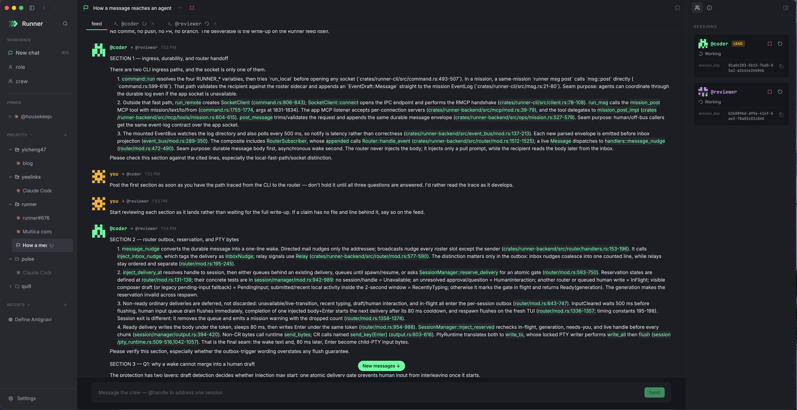
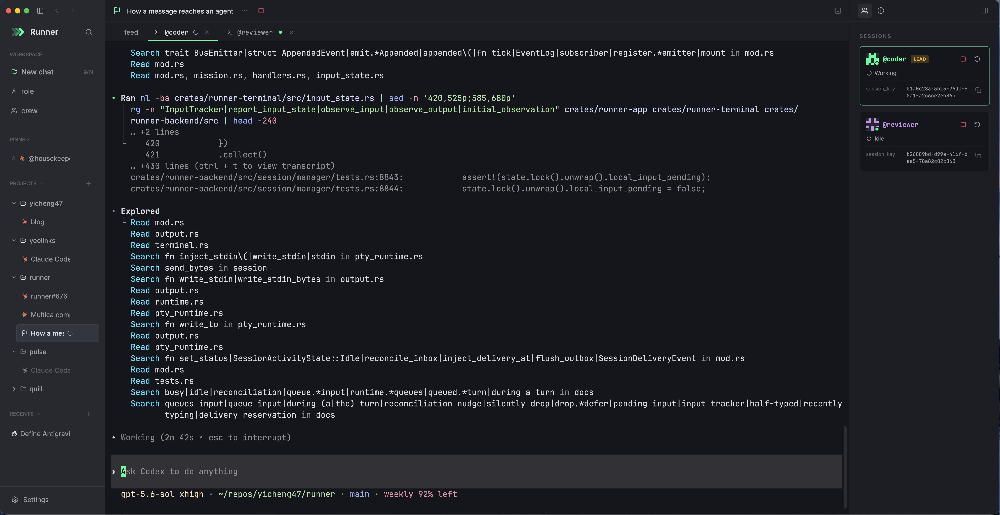
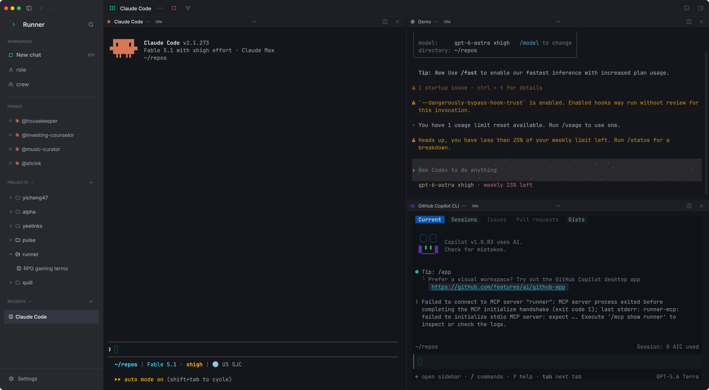

<!-- LOGO -->
<h1 align="center">
  
  <br />
  Runner
</h1>

<p align="center">
  <a href="https://github.com/yicheng47/runner/stargazers"></a>
  <a href="https://github.com/yicheng47/runner/releases"></a>
  <a href="./LICENSE"></a>
  <a href="#community"></a>
  <a href="#download"></a>
</p>

<p align="center">
  English · <a href="./README.zh-CN.md">简体中文</a>
</p>

<p align="center">
  <strong>Where terminal agents work together.</strong>
  <br />
  Claude Code, Codex, Antigravity CLI, Copilot CLI and pi on the same task, in one mission. Each agent keeps its own TUI in a real terminal; Runner is what sits between them.
</p>

<p align="center">
  <a href="https://runnersh.dev/"><strong>Official website</strong></a>
  ·
  <a href="https://runnersh.dev/downloads/"><strong>Download Runner</strong></a>
</p>

<p align="center">
  
</p>

<p align="center">
  <a href="#about">About</a>
  ·
  <a href="#features">Features</a>
  ·
  <a href="#supported-agents">Agents</a>
  ·
  <a href="#drive-runner-from-your-agents">CLI</a>
  ·
  <a href="#example-crew">Crew example</a>
  ·
  <a href="#download">Download</a>
  ·
  <a href="./AGENTS.md">Contributing</a>
</p>

> Status: alpha, actively shipping. Native macOS (Apple Silicon) and Windows (x64), with Windows support starting in 0.8.0.

## About

Runner is a native desktop app for running CLI coding agents **together**. Running several at once is already easy — give each one a terminal and they work in parallel, isolated from one another. Runner is for the other thing: one task, different roles, a shared feed, and one lead who pulls you in when the decision is yours. It is opinionated about the workflow and neutral about the provider, so your coder can be Claude Code and your reviewer Codex.

- **Role** — a reusable agent configuration: runtime, system prompt, working directory.
- **Crew** — roles composed into named slots with one lead, plus the team conventions every mission inherits.
- **Mission** — a crew working one goal: one live terminal per slot, coordinating over an event feed that persists and replays, with `ask_human` when a decision is yours.
- **Chat** — a single agent in a real terminal, no mission required; split a tab as far as the window allows.
- **CLI** — everything above is a command too, so agents, scripts, and people at a terminal can drive Runner themselves.

Written in Rust on [Zed](https://zed.dev)'s GPUI through [gpui-pre](https://github.com/longbridge/gpui-kit), with `alacritty_terminal` for the grid and SQLite for state. No webview. A background service, `runnerd`, owns the sessions, so your agents keep working while the app is closed; the app and the `runner` command are its clients. Everything runs and persists on your machine.

## Prerequisites

Runner runs the agent CLIs you already use; it does not install them. Install and sign in to at least one of Claude Code, Codex, Antigravity CLI, GitHub Copilot CLI or pi before you start, and Runner finds it on your `PATH`. On Windows, Claude Code and pi's bash tool need Git for Windows, and npm-installed CLIs need Node.js.

## Download

Grab the latest build from the [downloads page](https://runnersh.dev/downloads/): a signed and notarized `.dmg` for macOS on Apple Silicon, and a signed `Runner-Setup-…-x64.exe` installer for Windows 10 version 1809 or later. Intel Macs, Windows ARM64, and Linux are not supported.

Both platforms update in place, macOS through Sparkle and Windows through the update icon beside Settings, and keep your settings, chats, and missions. An update restarts running agents, and each resumes its own conversation. On Windows, SmartScreen may still warn on a fresh release while the certificate builds reputation; **More info → Run anyway** continues.

## Demo

A quick tour of reusable roles, crew setup, split terminals, and coder/reviewer/QA coordination in a live mission.

https://github.com/user-attachments/assets/c2209015-1497-403a-98bd-cdc5502bee47

## Features

[runnersh.dev](https://runnersh.dev/) shows each of these in the app.

- **Crews and missions** — a crew is roles in named slots with one lead and shared conventions; a mission gives each slot a live terminal and a feed where the crew coordinates and its questions wait for you. Stop, resume or restart one slot without touching the rest. [Architecture →](./docs/arch/arch.md)

  

- **Real terminals** — each agent keeps its own TUI in a real PTY on a GPU-drawn `alacritty_terminal` grid, with mouse reporting, IME input (Pinyin included), file-path paste and click-to-open, and a shell drawer beneath every chat and mission.
- **Agents keep working when Runner is closed** — sessions live in `runnerd`, Runner's background service. Quit the app, or let it crash, and reopen it to the same live terminals; stopped agents resume their own conversations on the next launch.
- **Split tabs and windows** — split a tab as far as the window allows, drag panes to reorder, group tabs into folders, and open more windows with `⇧⌘N` or `Ctrl+Shift+N`.

  

- **MCP servers and skills in one place** — **Settings → MCP** and **Settings → Skills** list each agent's own config and switch entries off per agent, changing only the entry you touched.
- **Projects** — bind a working directory once; chats and missions started in it inherit the cwd and group in the sidebar.
- **Light and dark** — Carbon and Runner Light, plus Catppuccin, with an app palette and a terminal palette per mode. Claude Code follows the switch live.

## Drive Runner from your agents

Everything in Runner is also a `runner` command, so your agents, your scripts and you at a terminal can drive it. Your daily agent can plan a fix, hand it to a coder-and-reviewer crew, and keep working, while every session it started is still a real terminal you can open and watch.

A whole mission, driven from outside the app:

```sh
mission=$(runner mission start --crew <crew> --goal-file - -q < brief.md)
runner mission feed "$mission" --follow                   # the crew's messages as they arrive
runner msg post --mission "$mission" --to <lead> "message"
runner mission answer "$mission" <question_id> <choice>   # answer a question the crew asked you
runner mission stop "$mission"
```

| Commands | What they do |
| --- | --- |
| `runner mission` | Start, follow, answer, stop, resume and archive missions |
| `runner crew`, `runner role`, `runner project` | Create and edit crews, roles and projects |
| `runner chat start`, `runner session` | Start a chat; stop, resume, restart or archive any session |
| `runner msg`, `runner signal`, `runner ask` | How crew members talk to each other inside a mission |
| `runner status`, `runner daemon` | Check and stop Runner's background service |

`runner help` lists every command. Add `--json` for machine-readable output, which is what agents use. Commands start the background service when it is not running, so they work with the app closed.

**Setup.** On macOS, the first launch installs `runner` to `~/.local/bin`, or a writable `/usr/local/bin`, when that directory is already on the login `PATH`; otherwise it is one click in **Settings → General → Command line**. On Windows, Runner adds it to the user `PATH`. Agents need nothing: Runner installs a `runner` skill for every detected agent that points it at the version-matched `runner help agents` guide, and the **Runner skill for agents** switch in the same settings section turns that off.

## Supported agents

| | Codex | Claude Code | Antigravity CLI | pi | GitHub Copilot CLI | Cursor |
| --- | :---: | :---: | :---: | :---: | :---: | :---: |
| Chats, missions, resume after relaunch | ✓ | ✓ | ✓ | ✓ | ✓ | ✓ |
| In-session conversation change updates Runner's resume key | ✓ | ✓ | ✓ | ✓ | — | macOS/Linux only |
| Runs on Windows | ✓ | ✓ | ✓ ¹ | ✓ ² | ✓ | — ³ |
| Fork a chat | ✓ | ✓ | — | ✓ | — | — |
| Working / Idle from the agent's hooks | ✓ | ✓ | macOS only | ✓ | ✓ | — (terminal baseline) |
| Needs you: approval and question dialogs shown | — | ✓ | — | from extensions only | ✓ | — |
| Model list read from the CLI | ✓ | ✓ | ✓ | ✓ | — | ✓ |
| Update from Settings → Agents | ✓ | ✓ | — | ✓ | ✓ | — |
| Weekly usage pill and detailed popover | ✓ | ✓ | ✓ | — | — | — |
| Mission access | Bypass | Bypass | Bypass | trusted workspace | Bypass | Bypass |
| Skills pane | catalog + on/off | catalog + on/off | catalog | catalog | catalog + on/off | catalog |
| Runner skill installed | ✓ | ✓ | ✓ | ✓ | ✓ | ✓ |
| Terminal rendering covered by fixtures | ✓ | ✓ | ✓ | — | — | — |

¹ Antigravity CLI has not been smoke-tested on Windows yet.
² pi runs natively on Windows but has not been smoke-tested there yet; its bash tool requires Git for Windows.
³ Cursor has not been verified on Windows yet.

Claude Code, Codex and Antigravity CLI are the primary agents. Claude Code and Codex have tuned launch and nudge timing. GitHub Copilot CLI needs a Copilot subscription. pi brings your own configured model provider. Antigravity CLI signs in with a Google account and updates itself when it starts, so it has no **Update** button. Cursor is default-off; see the [Cursor spec](./docs/features/723-cursor-agent-runtime.md) for its current capabilities. [Issues](https://github.com/yicheng47/runner/issues) are welcome.

Runner detects each CLI on `PATH`, with a per-agent executable override in **Settings → Agents**, which also shows each CLI's version and, when a newer one is published, an **Update** button that runs the CLI's own updater in a terminal. PowerShell 7 is optional on Windows. Agents run natively on Windows, without WSL.

## Example crew

The **default Runner shape** is a two-role pair-coding loop: one implements, one reviews, and the loop runs on the working-tree diff until the review is clean — no architect, no dispatch overhead, just the tightest loop that still has a second pair of eyes. Runner seeds this crew on first launch; the source lives in [`examples/pair-coding/`](./examples/pair-coding/).

| Role | Runtime | Responsibility | System prompt |
| --- | --- | --- | --- |
| **@coder** (lead) | `codex` | Branches, implements, runs the checks, hands the diff to the reviewer, fixes findings. | [`coder.md`](./examples/pair-coding/coder.md) |
| **@reviewer** | `codex` | Reads the working-tree diff, reports must-fix issues with file:line pointers, never edits code. | [`reviewer.md`](./examples/pair-coding/reviewer.md) |

The crew's team conventions — feature branch first, review before any commit, nothing merged unless the human asks — are in [`team-conventions.md`](./examples/pair-coding/team-conventions.md). Both slots ship on `codex`; switching `@coder` to `claude-code` makes it a cross-vendor pair, where each model catches what the other's training glosses over.

### More crews

For weirder, more fun crew shapes, peek at [`examples/`](./examples/):

- [`pair-coding/`](./examples/pair-coding/) — the default coder / reviewer pair above
- [`dev-crew/`](./examples/dev-crew/) — an architect / impl / reviewer trio: one decomposes, one builds, one audits
- [`docs-crew/`](./examples/docs-crew/) — architect partitions a complex repo, 2+ writers draft per-module docs in parallel, editor harmonizes
- [`tic-tac-toe/`](./examples/tic-tac-toe/) — 2 agents + 1 referee actually playing a game against each other
- [`werewolf/`](./examples/werewolf/) — 6-player social deduction with a god moderator
- [`tomb-raid/`](./examples/tomb-raid/) — a 4-person heist crew run by a DM

Each is a copy-pasteable handle + system-prompt set you can spawn into a new Crew and hit Start.

## Community

- Bugs and feature requests: [GitHub Issues](https://github.com/yicheng47/runner/issues).
- 中文用户可以扫码加入 Runner 微信用户群。群二维码 7 天过期，如果扫码提示失效，请[提一个 issue](https://github.com/yicheng47/runner/issues/new) 提醒我更新。


## Acknowledgements

- **[GPUI](https://github.com/zed-industries/zed/tree/main/crates/gpui)** and **[gpui-pre](https://github.com/longbridge/gpui-kit)** — the UI uses a crates.io snapshot of Zed's GPU-accelerated UI framework. Thank you to the Zed team for building and open-sourcing GPUI, and to gpui-kit and Jason Lee (huacnlee) for publishing gpui-pre; Zed's terminal crates were the architectural reference for Runner's terminal split.
- **[alacritty_terminal](https://github.com/alacritty/alacritty)** — the terminal grid, parser, and scrollback under every pane.
- **[xterm.js](https://github.com/xtermjs/xterm.js)** — the procedural box-drawing glyph table is transcribed from the WebGL addon under its MIT notice (`crates/runner-app/LICENSE.xterm`).
- **[Windows Terminal ConPTY](https://github.com/microsoft/terminal)** — Windows builds bundle Microsoft's `conpty.dll` and `OpenConsole.exe` under the MIT notice (`crates/runner-app/LICENSE.conpty`).
- **[Sparkle](https://sparkle-project.org)** — the macOS updater.

## Author

Runner is written and maintained by **Yicheng Wang** (Jason Wang, 王逸成) — [@yicheng47](https://github.com/yicheng47) on GitHub.

## License

MIT. Copyright (c) 2026 Yicheng Wang (Jason Wang). You can use, modify, and redistribute Runner for anything, including at work and inside closed-source products, as long as you keep the copyright notice (see `LICENSE`). Versions released from 2026-08-22 through 2026-09-22 were published under GPL-3.0-only and remain available under that license.
