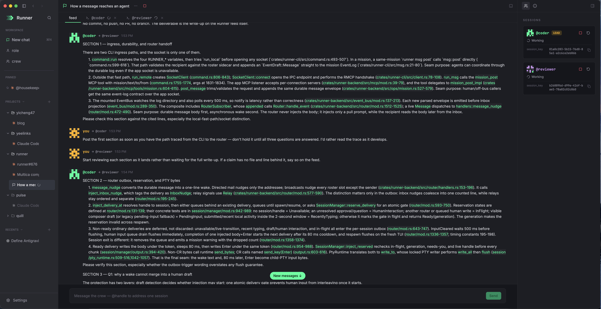
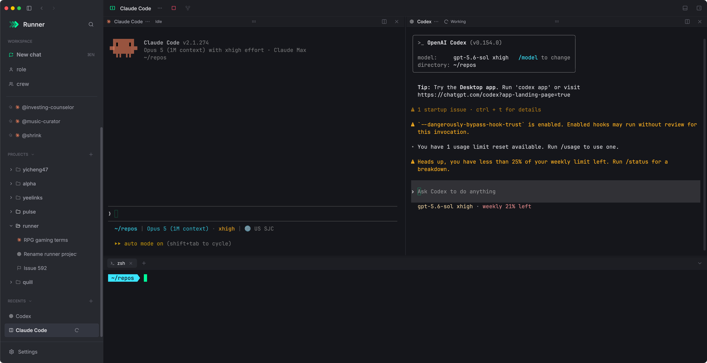
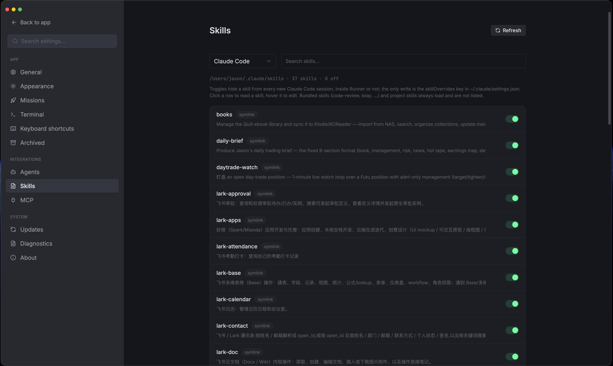
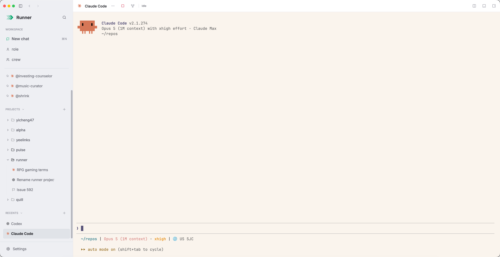
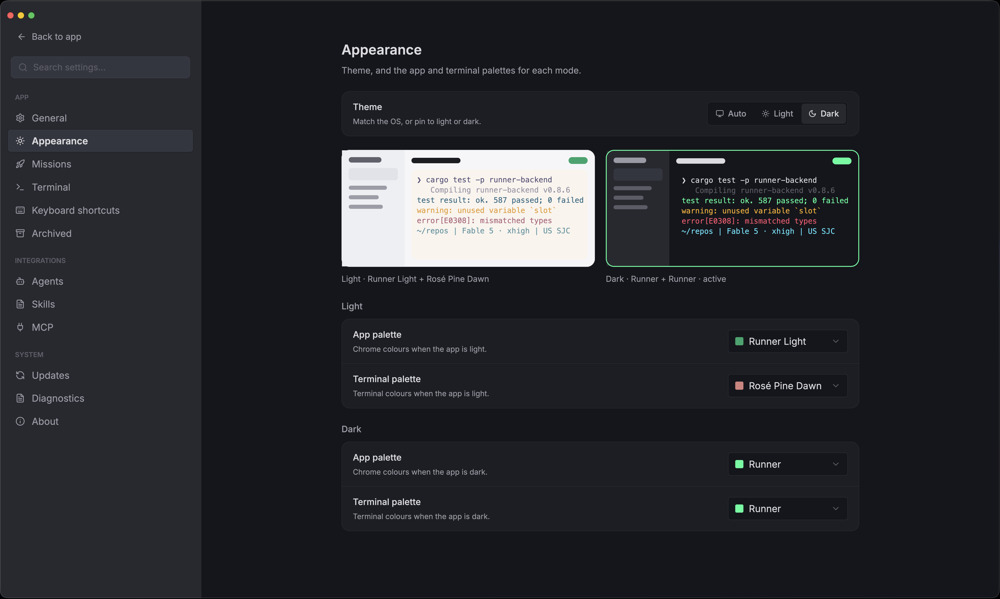

<!-- LOGO -->
<h1 align="center">
  
   
  Runner
</h1>

  
  
  
  
  

  <a href="./README.md">English</a> · 简体中文

  <strong>创建 runner，组建 crew，交付功能。</strong>
   
  一个专为编排编码 agent 而生的原生终端。Claude Code 和 Codex 保留各自的 TUI，Runner 在它们之上加上会话、技能和 crew。

  <a href="https://github.com/yicheng47/runner/releases/latest"><strong>下载 Runner</strong></a>

  

  <a href="#关于">关于</a>
  ·
  <a href="#功能">功能</a>
  ·
  <a href="#支持的-agent">Agent</a>
  ·
  <a href="#在一个地方管理-mcp-服务与技能">MCP</a>
  ·
  <a href="#示例-crew">Crew 示例</a>
  ·
  <a href="#下载">下载</a>
  ·
  <a href="#文档">文档</a>
  ·
  <a href="./AGENTS.md">参与贡献</a>

> 状态：alpha，持续迭代中。原生支持 macOS（Apple Silicon）和 Windows（x64），Windows 从 0.8.0 起加入。

## 关于

Runner 是一个原生桌面应用，用来同时运行多个命令行编码 agent。Claude Code 和 Codex 在真实终端里保留自己的 TUI，Runner 是包在它们外面的那一层。

- **Runner** — 一份可复用的 agent 配置：运行时、角色、系统提示词、工作目录。
- **Crew** — 把若干 runner 组合成有名字的槽位，指定一个 lead，再加上每个 mission 都会继承的团队约定。
- **Mission** — 一个 crew 围绕一个目标干活：每个槽位一个实时终端，通过一条可持久化、可回放的事件 feed 协作，需要你拍板时用 `ask_human` 提问。
- **Chat** — 单个 agent 跑在一个真实终端里，不需要 mission；一个标签页最多并排三个。
- **MCP** — 上面的一切也都是 MCP 工具，你的 agent 可以自己操作 Runner。

用 Rust 写成，基于 [gpui-ce](https://github.com/gpui-ce/gpui-ce)（[Zed](https://zed.dev) GPUI 的社区分支），终端网格用 `alacritty_terminal`，状态存在 SQLite。没有 webview。一切都在你自己的机器上运行和保存。

## 下载

在[发布页](https://github.com/yicheng47/runner/releases/latest)获取最新版本：macOS（Apple Silicon）是已签名并完成公证的 `.dmg`，Windows 10 1809 或更高版本是已签名的 `Runner-Setup-…-x64.exe` 安装包。Intel Mac、Windows ARM64 和 Linux 暂不支持。

两个平台都支持原地更新，macOS 走 Sparkle，Windows 走 Settings 旁边的更新图标，设置、对话和 mission 都会保留。在 Windows 上，证书积累信誉之前，新版本可能仍会触发 SmartScreen 警告，点 **更多信息 → 仍要运行** 即可继续。

想用今天刚合并的东西？[`nightly` 预发布版](https://github.com/yicheng47/runner/releases/tag/nightly)从 `main` 构建，两个平台都有，签名方式相同，并在自己的渠道里更新。

## 社区

- Bug 和功能建议：[GitHub Issues](https://github.com/yicheng47/runner/issues)。
- 扫码加入 Runner 微信用户群。群二维码 7 天过期，如果扫码提示失效，请[提一个 issue](https://github.com/yicheng47/runner/issues/new) 提醒我更新。

## 演示

一个三人 crew（两名玩家加一名裁判）通过 mission feed 互相对弈井字棋，来自示例 crew [`tic-tac-toe`](./examples/tic-tac-toe/)。

https://github.com/user-attachments/assets/fb3669a4-010d-42d0-9555-2a3ba3223c75

## 功能

<table>
<tr>
<td width="50%">
  
</td>
<td width="50%" valign="middle">

### Crew — 角色、提示词、一个 lead

**runner** 是一份可复用的 agent 配置：运行时、角色、系统提示词、工作目录。**crew** 把 runner 组合成有名字的槽位，指定唯一一个 lead，再加上团队约定和完成定义，每个 mission 都会继承。

</td>
</tr>
<tr>
<td width="50%">
  
  
</td>
<td width="50%" valign="middle">

### Mission — 一个 crew 围绕一个目标

启动 mission 会为每个槽位拉起一个实时 PTY，放进一个带标签页的工作区。**feed** 是 crew 协作的地方：一条只追加的事件日志，每条信号都持久化、可回放，所以 mission 能扛住退出或崩溃，`ask_human` 的问题也会在这里等你回答。每个**槽位**都是隔壁标签页里的一个真实终端，跑着 agent 自己的 TUI，你可以看、可以输入，也可以单独停止、恢复或重启这个 runner。

[架构 →](./docs/arch/arch.md)

</td>
</tr>
<tr>
<td width="50%">
  
</td>
<td width="50%" valign="middle">

### Chat — 标签页、分栏、文件夹

每个 chat 都是和一个 runner 一对一的真实 PTY，不需要 mission。一个标签页最多并排三栏，可以让一个 Claude Code 和一个 Codex 在同一个视图里处理同一个问题。侧边栏把标签页归进可折叠的文件夹；某一栏还在工作时标签页显示转圈，你不在时有一栏完成了则显示一个圆点，一整墙并行的 agent 也能一眼扫清。

</td>
</tr>
<tr>
<td width="50%">
  
</td>
<td width="50%" valign="middle">

### 终端抽屉

每个 chat 和每个 mission 下方都有一个 shell，一个快捷键就能打开，工作目录和上面的 agent 相同。跑一下 agent 刚写的测试、看看 `git status`、tail 一个日志，都不用离开这一栏，也不用再开一个终端应用。抽屉里可以开任意多个 shell，回来时还在你离开的地方。

</td>
</tr>
<tr>
<td width="50%">
  
</td>
<td width="50%" valign="middle">

### 多窗口

macOS 上按 `⇧⌘N`、Windows 上按 `Ctrl+Shift+N` 可以打开更多系统窗口，比如一块屏幕放 mission，另一块放一整墙的 chat。窗口之间会协调共享会话的归属：主窗口持有 PTY，其他显示同一会话的窗口会看到一个接管浮层，而不是一个错乱的终端。

</td>
</tr>
<tr>
<td width="50%">
  
  
</td>
<td width="50%" valign="middle">

### 在一个地方管理 MCP 服务与技能

每个 agent 都把自己的 MCP 服务和技能放在各自的配置文件里。**Settings → MCP** 和 **Settings → Skills** 读取这些文件，按 agent 各显示为一个列表：选 Claude Code 或 Codex，看到它拥有的一切，拨一下开关就能在该 agent 的新会话里关掉某个服务或技能，点一下技能就能阅读或编辑。Runner 只改动你碰过的那一条，文件的其余部分原样保留。

### 让你的 agent 来驱动 Runner

Runner 本身也是一个 MCP 服务。**Settings → Agents** 把它注册到 Claude Code、Codex 和 TRAE CLI，此后它们中的任何一个都可以创建 crew 和项目、启动 mission、读取 feed、回答问题或开一个 chat。真正能复利的地方在于：你日常用的 agent 规划好一个修复，派出一个 coder 加 reviewer 的 crew 去实现，然后继续干自己的事，而它拉起的每个会话仍然是一个你随时可以打开查看的真实终端。

</td>
</tr>
<tr>
<td width="50%">
  
  
</td>
<td width="50%" valign="middle">

### 专为 Runner 设计的浅色与深色

Carbon 和 Runner Light 是 Runner 自己的主题，Catppuccin Mocha 和 Latte 随行。Auto 跟随系统，Light 和 Dark 固定模式，Claude Code 对话会在切换的一瞬间跟上，不用重启，也不用敲 `/theme`。

### 每种模式一套配色，实时预览

**Settings → Appearance** 为浅色和深色各选一套应用配色和一套终端配色，上方实时预览两种模式，所以浅色应用自然配浅色终端，不需要再设一次。浅色终端默认是 Rosé Pine Dawn。

</td>
</tr>
</table>

### 还有这些

- **项目** — 绑定一次工作目录；在项目里发起的 chat 和 mission 都会继承它的 cwd，并归在侧边栏里自己的分组下。agent 也可以通过 MCP 创建、重命名、归档和删除项目。
- **Mission 控制** — 停止、恢复或重启单个槽位，不用重启整个 mission；重启的 runner 会带着最初的任务简报重新开始。mission 默认以 Bypass 权限模式运行，Accept-edits 和 Default 在设置里一步可达，也不会卡在 agent 的首次授权对话框上。
- **会话不随应用退出而结束** — 退出或崩溃不会杀掉你的 agent；下次启动会重新接上仍在运行的会话，工作进行中时退出会先询问。
- **真实终端** — 每一栏都是跑在 GPU 绘制的 `alacritty_terminal` 网格上的真实 PTY：agent 自己的配色、鼠标上报、输入法（包括拼音）、复制、文件路径粘贴、10,000 行回滚。点击文件路径可在编辑器里打开；选中一段输出可以在侧线程里追问；⌘+ 和 ⌘− 把整个应用从 60% 缩放到 200%。
- **内置 `runner` CLI** — 被拉起的 agent 可以在自己的 PTY 里互发消息、查看 crew 名册、发送信号。

## 支持的 Agent

| Agent | macOS（Apple Silicon） | Windows（x64） |
| --- | --- | --- |
| Claude Code | 支持 | 支持 |
| Codex | 支持 | 支持 |
| TRAE CLI | 实验性 | 未验证 |

Claude Code 和 Codex 是主要支持的 agent，终端渲染有夹具测试覆盖，启动和催促时序也做过调优。TRAE CLI 用得较少，可能有粗糙之处；macOS 上检测到后默认启用，Windows 上默认禁用，因为 Runner 与它的集成尚未在 Windows 上验证。欢迎提 [issue](https://github.com/yicheng47/runner/issues)。

agent 的命令行工具需要单独安装。Runner 会在 `PATH` 上检测它们，也可以在 **Settings → Agents** 里为每个 agent 单独指定可执行文件。在 Windows 上，Claude Code 还需要 Git for Windows 提供的 Git Bash；通过 npm 安装的 CLI 需要 Node.js。PowerShell 7 可选。agent 在 Windows 上原生运行，不需要 WSL。

## 示例 Crew

**Runner 的默认形态**是一个双 runner 的结对编程循环：一个实现，一个审查，循环基于工作树 diff 一直跑到审查通过为止。没有架构师，没有派发开销，只有一个仍然保留第二双眼睛的最紧凑的循环。Runner 首次启动时会预置这个 crew，源文件在 [`examples/peer-coding/`](./examples/peer-coding/)。

| Runner | 运行时 | 角色 | 系统提示词 |
| --- | --- | --- | --- |
| **@coder**（lead） | `codex` | 开分支、实现、跑检查，把 diff 交给 reviewer，修复发现的问题。 | [`coder.md`](./examples/peer-coding/coder.md) |
| **@reviewer** | `codex` | 阅读工作树 diff，用 file:line 指出必须修复的问题，从不改代码。 | [`reviewer.md`](./examples/peer-coding/reviewer.md) |

这个 crew 的团队约定（先开功能分支、提交前必须审查、没有人的指示不合并）写在 [`team-conventions.md`](./examples/peer-coding/team-conventions.md)。两个槽位默认都用 `codex`；把 `@coder` 换成 `claude-code` 就成了跨厂商的搭档，各自能抓住对方训练里忽略的东西。

### 更多 Crew

想看更奇特、更有趣的 crew 形态，去 [`examples/`](./examples/) 逛逛：

- [`peer-coding/`](./examples/peer-coding/) — 上面默认的 coder / reviewer 搭档
- [`dev-crew/`](./examples/dev-crew/) — 架构师 / 实现者 / 审查者三人组：一个拆解，一个构建，一个审计
- [`docs-crew/`](./examples/docs-crew/) — 架构师划分一个复杂仓库，两个以上的写手并行起草各模块文档，编辑统一风格
- [`tic-tac-toe/`](./examples/tic-tac-toe/) — 两个 agent 加一个裁判，真的在互相下棋
- [`werewolf/`](./examples/werewolf/) — 六人狼人杀，由一个上帝主持
- [`tomb-raid/`](./examples/tomb-raid/) — 一支四人盗宝小队，由 DM 主持

每一个都是一套可以直接复制的 handle 加系统提示词，新建一个 Crew 粘进去，点 Start 就能跑。

## 文档

架构、运行时契约、产品愿景和各功能的规格都在 [`docs/`](./docs/)。想看底层协议从 [`docs/arch/arch.md`](./docs/arch/arch.md) 开始，想看产品方向读 [`docs/product/vision.md`](./docs/product/vision.md)。

macOS 和 Windows 在 `main` 上一起开发。开发环境、前置依赖和贡献者约定见 [AGENTS.md](./AGENTS.md)。

## 致谢

- **[GPUI](https://github.com/zed-industries/zed/tree/main/crates/gpui)** 与 **[gpui-ce](https://github.com/gpui-ce/gpui-ce)** — UI 构建在 gpui-ce 之上，这个社区分支让 Zed 的 GPU 加速 UI 框架能在 Zed 之外发布和使用。感谢 Zed 团队构建并开源了这个框架，感谢 gpui-ce 维护者们把它延续下去；Zed 的终端 crate 是 Runner 终端分层的架构参考。
- **[alacritty_terminal](https://github.com/alacritty/alacritty)** — 每一栏底下的终端网格、解析器和回滚。
- **[xterm.js](https://github.com/xtermjs/xterm.js)** — 程序化绘制的制表符字形表按其 MIT 声明转录自 WebGL 插件（`crates/runner-app/LICENSE.xterm`）。
- **[Windows Terminal ConPTY](https://github.com/microsoft/terminal)** — Windows 构建按 MIT 声明内置了微软的 `conpty.dll` 和 `OpenConsole.exe`（`crates/runner-app/LICENSE.conpty`）。
- **[Sparkle](https://sparkle-project.org)** — macOS 的更新器。

## 作者

Runner 由 **王逸成**（Yicheng Wang / Jason Wang）编写和维护，GitHub 账号 [@yicheng47](https://github.com/yicheng47)。

## 许可证

GPL-3.0-only。Copyright (C) 2026 Yicheng Wang (Jason Wang)。Runner 是自由软件：你可以将它用于任何用途，包括工作，并可在 GNU 通用公共许可证 v3.0 的条款下再分发或修改，但你分发的修改版本必须保持同一许可证（见 `LICENSE`）。2026-08-22 之前发布的版本以 MIT 许可证发布，并保持不变。
