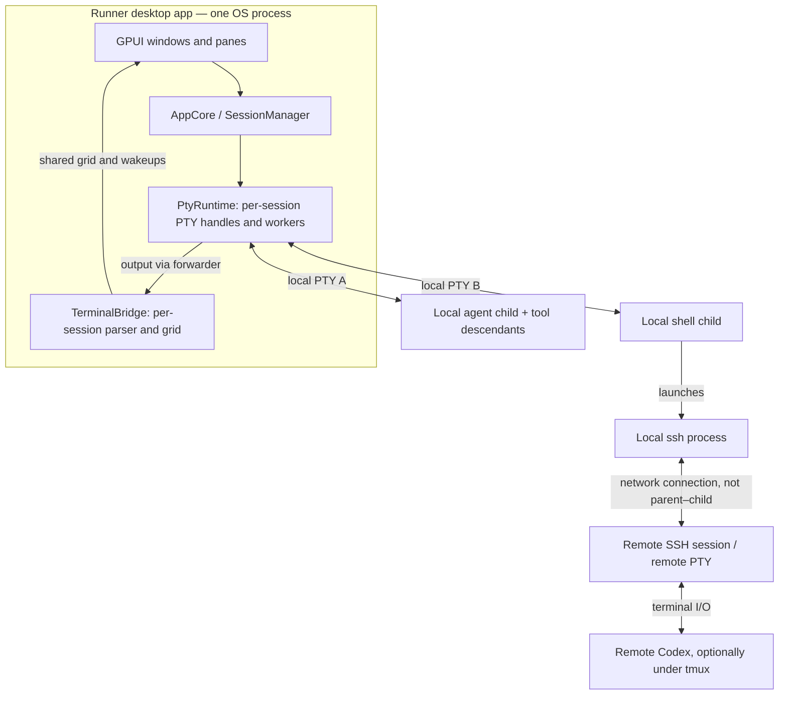
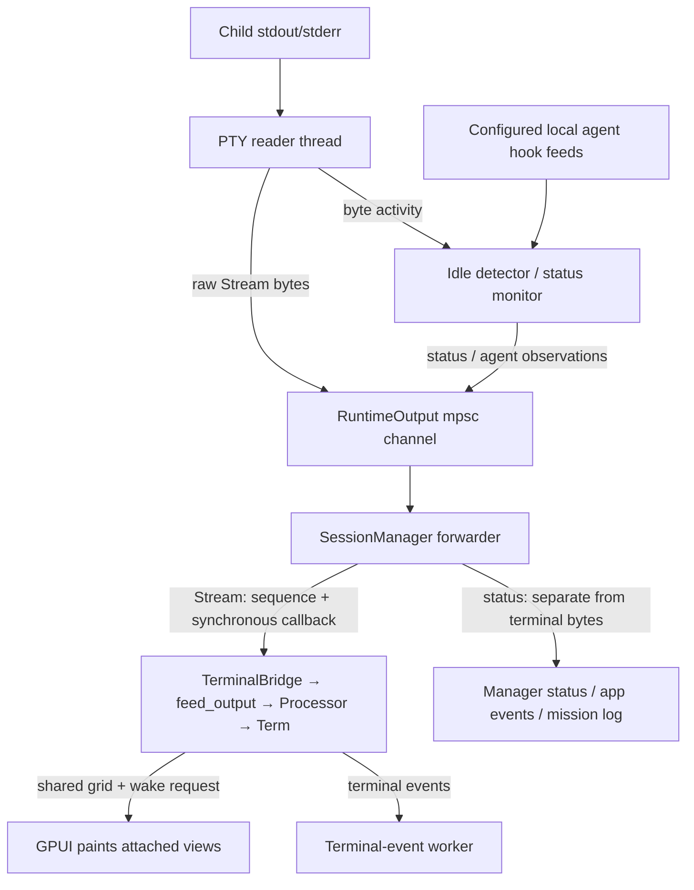

# Runner process and terminal runtime model

Current implementation, inspected on 2026-09-21 at `d85b9c1`. This describes the runtime architecture in this checkout, not the proposed Alacritty integration in [#647](../features/647-terminal-runtime-integration.md). See [Architecture](./arch.md) for the domain model and mission coordination protocol.

## 1. OS processes versus Rust components

Runner's GPUI windows, `AppCore`, `SessionManager`, `PtyRuntime`, and terminal models run inside one desktop app process. Crate boundaries are not process boundaries. There is no separate terminal-host daemon and no Alacritty executable running behind a pane.

Each live session has its own local PTY and a spawned root child: an agent CLI, a shell, or a platform launch wrapper. That child can launch more processes for tools, commands, hooks, or the bundled `runner` CLI. A mission groups sessions; it is not itself an OS process. Multiple windows share the app's session manager and terminal registry.

The diagram shows example sessions, not a snapshot of currently running processes. On Windows, ConPTY also has a console-host process; Runner ships `conpty.dll` and `OpenConsole.exe` beside the app. Those platform helpers do not move `SessionManager` or the terminal parser out of Runner. See [Windows development](./windows.md).

For an ordinary shell → SSH → Codex session, Runner owns the local shell/SSH process tree and renders the bytes arriving through the local PTY. It does not own the remote Codex PID or automatically install its local agent-status hooks on the server. Stopping the local session closes the SSH connection, but is not a guarantee that remote jobs terminate; a remote tmux session can survive independently.

## 2. Ownership inside the app

| Component | Owns | Does not own |
| --- | --- | --- |
| `AppCore` / `SessionManager` (`runner-backend`) | Session identity and lifecycle, spawn/resume policy, delivery gates, status projections, output sequence numbers, and manager forwarders. | Terminal parsing or rendering. |
| `PtyRuntime` (`runner-backend`) | Live PTY handles, child handle/PID, serialized writer, process-tree supervision, reader and idle/status workers. | SQLite or the terminal grid. |
| `TerminalBridge` / `TerminalSession` (`runner-terminal`) | One persistent `Processor` and shared `Term` per live session, input-state observations, terminal-event handling, palette/title state, and viewer leases. | Child creation, reaping, or the PTY reader. |
| GPUI terminal surface (`runner-app`) | Layout measurement, rendering, selection interaction, key/mouse/IME encoding, and requests to send input or resize. | Session lifetime or parser progress. |

The dependency direction is `runner-app → runner-terminal → runner-backend`; the app also uses the backend directly. The backend synchronously calls the `SessionEvents` observer interface implemented by `TerminalBridge`, so it can deliver output without depending on the terminal crate. The bridge is installed once by the shared `AppStore`.

## 3. Per-session workers

The normal live terminal path has four persistent Runner threads per session, plus a fifth for mission-pane user input. This is not a total OS-thread count: GPUI, file watchers, application services, and transient startup/resize tasks add other work.

| Worker | Where | Work and wait condition |
| --- | --- | --- |
| `pty-reader-<id>` | `PtyRuntime` | Blocks in PTY `read`, updates byte-activity bookkeeping, and sends raw chunks to `OutputStream`. At EOF/error, ends the status monitor and waits for the child if it still owns the child handle. |
| `pty-idle-<id>` | `PtyRuntime` | Checks baseline idle detection and drains configured agent-hook observations every 50 ms. On Windows, also detects root-child exit and closes the PTY master so the reader can finish draining. |
| Manager forwarder (unnamed) | `SessionManager` | Receives `RuntimeOutput` with a 500 ms timeout, coalesces immediately available byte chunks, publishes observations, and synchronously feeds the terminal observer. Reconciles lifecycle on termination. |
| `native-term-events-<id>` | `TerminalSession` | Blocks in `rx.recv()`. Handles terminal-generated replies, color/size queries, and title changes. Other Alacritty event variants currently fall through. |
| `native-term-input-<id>` (mission sessions only) | `TerminalSession` | Receives queued user input and calls the manager's gated input path off the UI thread. Direct-chat/shell user input calls that path inline. |

There is no separate parser thread: `TerminalSession::feed_output` runs synchronously on the manager forwarder. The GPUI main thread reads the shared grid when painting. The terminal-event worker is not an Alacritty PTY event loop and does not advance the parser.

## 4. Output, status, and rendering

The reader-to-forwarder boundary is an unbounded `std::sync::mpsc` queue, not a synchronous call. From the forwarder onward, `record_output → SessionEvents::output → TerminalBridge::output → feed_output` is synchronous. Bytes are not serialized through a webview or sent through the app-event broadcast before parsing. Coalescing means a forwarded chunk need not correspond to one PTY read.

`feed_output` records fixture bytes when enabled, tracks sequence/readiness/first-paint information, intercepts color-scheme sequences, and advances the persistent VTE parser against the shared grid. Its main lock order is sequence state → parser → input tracker → terminal grid. It releases those locks before reporting the resulting input-state observation to the manager.

Output feeding continues when no pane is attached. Ordinary output wakes GPUI only while the terminal has a viewer; `EventProxy` and title handling can also request wakes independently. `AppStore` batches terminal wakeups over a 4 ms window. That batching affects UI notification, not when parsing happens.

Agent status is a different stream from screen state. Baseline busy/idle detection uses PTY-byte activity with a 2 s silence threshold and a 500 ms resize grace window. Configured hook watchers supply richer observations for supported local agents. The manager decides how those observations affect its status projection and mission delivery; a quiet terminal is not, by itself, proof that an agent has finished a task.

## 5. Input, terminal replies, and resizing

User input flows from the terminal surface through `TerminalSession` into `SessionManager::inject_direct_stdin`, which coordinates with the delivery gate. Direct chats call it inline; mission panes enqueue bytes to their input worker. Router delivery uses the manager's reserved/gated injection paths. The distinction keeps a user draft and a routed prompt from being treated as interchangeable input.

Terminal protocol replies take a separate path: parser event → terminal-event worker → `SessionManager::inject_stdin`. Color, size, and other terminal replies bypass the user delivery gate; they are protocol traffic, not typed text. Color-scheme interception feeds replies into the same terminal-event channel.

All these paths ultimately reach `PtyRuntime`'s per-session writer mutex and blocking `write_all`/`flush`. That serializes individual writes; it is not an event-loop-owned nonblocking write queue. A slow consumer can block the calling worker, and direct-chat inline writes can block their caller. Ordered multi-step prompt/paste delivery is managed above the writer.

Resize is another direct path. `TerminalSession::resize` updates its logical size, calls the backend to resize the PTY, then locks and resizes the `Term`. The manager separately settles the persisted size after resize activity. PTY and grid resizing are separate operations, not a single command ordered with reads and writes by one runtime loop. Resizing does not flush a pending synchronized update.

## 6. Lifecycle and cleanup

### Spawn and attach

The manager resolves the command, environment, initial geometry, and session/agent identity, then passes a `SpawnSpec` to `SessionRuntime::spawn`. `PtyRuntime` opens the PTY, launches the child on its slave side, drops the parent's slave handle, adopts process-tree supervision, keeps the master/writer/child handles, and starts reading. Bytes can queue before the manager starts consuming them.

The manager installs its live handle and emits the spawn event. `TerminalBridge` creates a terminal with the initial geometry; a first-output fallback can create it if needed. The manager forwarder then consumes output. A pane attaches a viewer lease to that existing terminal; hiding or detaching the view alone does not stop the process or discard its parser/grid. Explicit stop/close actions can separately request termination.

### Natural exit and explicit stop

On normal EOF, the reader stops/joins its monitor and captures the child's exit status if it still owns the child handle. Once the output senders are gone, the forwarder reaches channel disconnection, checks runtime status, performs best-effort runtime cleanup, updates the session row/status, and emits `session/exit`. The bridge removes its registry entry; the UI shows the stopped/resumable state.

An explicit stop starts at `SessionManager::kill`: mark intentional termination, ask the runtime to stop and reap the child, then clear the live handle, cancel delivery/forwarding, and join the forwarder for lifecycle reconciliation. If runtime stop fails, the manager retains the live handle and reports the error rather than declaring the session stopped.

- On macOS/Unix, the runtime snapshots descendants before signaling, requests SIGHUP, allows a 6 s production grace period, and escalates to process-group SIGKILL if necessary. It also sweeps the captured descendants that outlive the root.
- On Windows, the root is assigned to a Job Object with kill-on-close behavior. Explicit stop terminates the job and checks root-child termination/reaping. The idle monitor's ConPTY-close path allows normal-exit output draining.

The child handle sits in a shared `Option`, so either the reader or the explicit-stop path can take responsibility for waiting on it. Cleanup is Runner policy, not something supplied solely by `portable-pty`.

Natural exit and explicit cancellation are not identical drain paths. Explicit kill sets the forwarder's stop flag after runtime stop, so the current code does not establish a blanket guarantee that every queued final byte is presented before an intentional stop returns. Final-output behavior needs its own acceptance tests during runtime replacement.

### Resume, restart, and app quit

Resume/restart creates a new child and a new terminal under the existing Runner session ID. A genuine agent resume asks the CLI to reopen its saved conversation; it does not reconnect to the old local process or restore an in-memory terminal grid. Manager delivery gates have generations for canceling in-flight delivery, but `RuntimeSession` itself identifies the runtime and session ID, not a unique process instance. Replacement work must account for delayed input/events rather than assuming session ID alone isolates instances.

Normal app quit marks eligible rows for resume-on-launch and stops local sessions through `kill_many`. Rows, agent conversation keys, and mission logs persist; the local PTY runtime is not a persistent daemon. Remote job survival across SSH disconnection remains the remote host's responsibility.

## 7. The boundary under review in #647

Runner currently adopts Alacritty's terminal model and VTE parser, but not its `tty` implementation or PTY `EventLoop`. Runner therefore implements PTY reads/writes, worker scheduling, resize delivery, child supervision, and application event handling itself, spread across the backend and terminal crates.

The confirmed missing responsibility is synchronized-update timeout servicing. With `alacritty_terminal` 0.26.0 / `vte` 0.15.0, the parser records a deadline for an unfinished synchronized update; Runner never checks `sync_timeout` or calls `stop_sync`. The manager's 500 ms receive timeout and the status monitor's 50 ms tick do not service that parser deadline. Later ordinary output or a resize need not release the buffered redraw.

The proposed work evaluates a session-owned Alacritty PTY/event loop while preserving Runner's session policy, process cleanup, status hooks, input routing, and observations. It does not propose a new OS process or daemon. This missing timeout is demonstrated independently; it is not yet proof of the original SSH black-pane incident's cause or resolution.

## Source map

- [App bootstrap](../../crates/runner-app/src/bootstrap.rs) and [shared AppStore](../../crates/runner-app/src/app_store.rs): runtime construction, bridge installation, wake batching, and app-quit cleanup.
- [Runtime contract](../../crates/runner-backend/src/session/runtime.rs) and [PTY implementation](../../crates/runner-backend/src/session/pty_runtime.rs): spawn, handles, read/write/resize, idle monitoring, waiting, and platform stop paths.
- [Session manager](../../crates/runner-backend/src/session/manager/mod.rs), [spawn](../../crates/runner-backend/src/session/manager/spawn.rs), [output/input](../../crates/runner-backend/src/session/manager/output.rs), and [lifecycle](../../crates/runner-backend/src/session/manager/lifecycle.rs): observation callbacks, forwarders, delivery gates, lifecycle reconciliation, and resume/restart.
- [Unix process supervision](../../crates/runner-backend/src/session/process/unix.rs) and [Windows process supervision](../../crates/runner-backend/src/session/process/windows.rs): foreground groups, descendants, process handles, and Job Objects.
- [Terminal model and bridge](../../crates/runner-terminal/src/terminal.rs): parser/grid ownership, reply/input workers, view leases, output observation, and resize ordering.
- [Terminal element](../../crates/runner-app/src/terminal/element.rs): grid rendering and geometry measurement.
