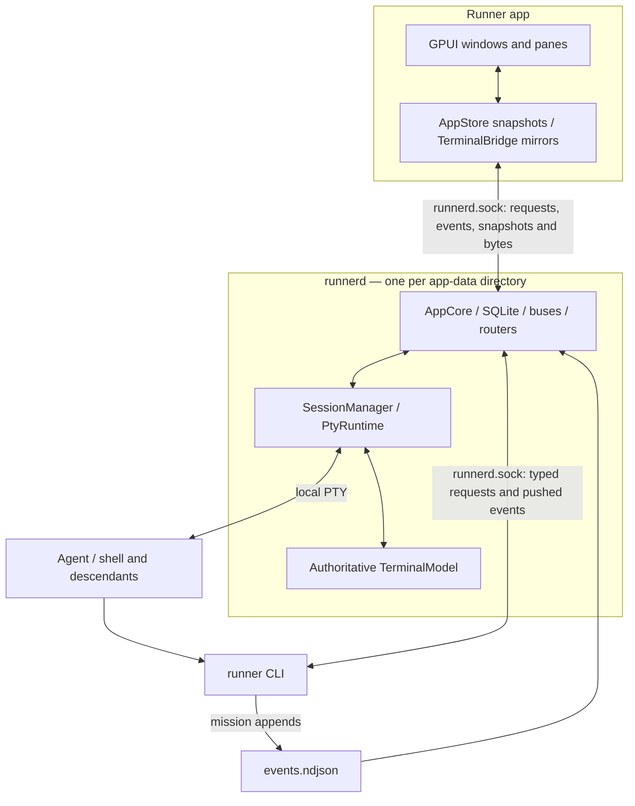

# Runner process and terminal runtime model

Current three-process implementation for [#645](../features/645-session-host.md), updated on 2026-10-06 from the process map on `origin/fix/647-terminal-black-sidebar`. [Architecture](arch.md) covers domain state and coordination; [Concurrency](concurrency.md) covers executors.

## OS processes and ownership

The desktop app owns GPUI windows, AppStore and terminal mirrors. `runnerd` owns AppCore, SQLite, SessionManager, PTYs, authoritative terminal models, mission buses and routers, usage and discovery. The `runner` CLI is a separate client process per command. Multiple app windows share one connection and mirror registry. A mission groups sessions; it is not an OS process.


```mermaid
flowchart TB
    subgraph app["Runner app"]
        ui["GPUI windows and panes"]
        store["AppStore snapshots / TerminalBridge mirrors"]
        ui <--> store
    end
    subgraph daemon["runnerd — one per app-data directory"]
        core["AppCore / SQLite / buses / routers"]
        manager["SessionManager / PtyRuntime"]
        terminal["Authoritative TerminalModel"]
        core <--> manager
        manager <--> terminal
    end
    store <-->|"runnerd.sock: requests, events, snapshots and bytes"| core
    cli["runner CLI"] <-->|"runnerd.sock: typed requests and pushed events"| core
    cli -->|"mission appends"| log["events.ndjson"]
    log --> core
    manager <-->|"local PTY"| child["Agent / shell and descendants"]
    child --> cli
```

On Windows, `runnerd.exe` has a hidden console and bundled `conpty.dll` and `OpenConsole.exe` beside it in app data. Agent process trees belong to kill-on-close jobs. The app is not their process owner. A shell → SSH session still owns only the local shell and SSH process tree; stopping it does not guarantee remote jobs terminate. A remote daemon and session protocol are phase 3.

| Component | Owns |
| --- | --- |
| AppCore / SessionManager (`runner-daemon`) | Session identity, spawn/resume policy, delivery gates, status, sequence numbers and manager forwarders. |
| PtyRuntime (`runner-daemon`) | PTY and child handles, writer mutex, process-tree supervision, reader and idle workers. |
| TerminalModel (`runner-terminal`, in daemon) | Persistent parser/grid, synchronization deadlines, draft observations and terminal replies. |
| TerminalBridge / TerminalMirror (`runner-terminal`, in app) | Attached mirrors, snapshots and stream sequencing, palette and viewer leases. |
| GPUI surface (`runner-app`) | Painting, selection, links, key/mouse/IME encoding and local resize feedback. |

The app’s production dependencies are `runner-core` and `runner-terminal`; `runner-daemon` is only a test dependency. The CLI links the daemon and dispatches to it when launched under the file stem `runnerd`.

## Per-session workers and output

The daemon keeps the blocking PTY reader, idle/status worker, manager forwarder, terminal-event worker and ordered input worker. GPUI, IPC and watcher threads add work at the process level.

```text
child bytes → PTY reader → RuntimeOutput queue → manager forwarder
                                               ├─ numbered bytes → client queues → app mirror → GPUI
                                               └─ authoritative parser/grid → draft observations
hooks → status monitor → SessionModel → mission log and AppEvents → AppStore
```

The reader-to-forwarder boundary is a channel. The forwarder publishes raw bytes before authoritative parsing so the app can parse concurrently. One sequence/model lock captures a snapshot and subscribes to later output atomically. The snapshot includes unfinished input and synchronized-update state. A slow client is dropped from its bounded terminal queue and asked to resync; it cannot hold up the agent.

Authoritative parsing continues without panes or clients. Only the daemon answers terminal queries; mirrors discard replies. The app batches terminal wakes over 4 ms. That delays notification, not parsing. Agent working/idle state is separate from screen bytes: hooks and the baseline detector feed the reducer, so output silence is not proof of turn completion.

## Input and resize

The app encodes keys, IME, paste and mouse against the mirror’s current modes. Input is a one-way client frame queued by the daemon per session, for both direct chats and missions. User input still passes the delivery gate; router input uses its reserved path. Terminal replies bypass that gate and ultimately share PtyRuntime’s writer mutex.

A pane resizes its mirror immediately and sends a one-way resize. The daemon resizes its PTY/model, emits `Resized` for other viewers and persists settled geometry. Snapshot restoration and live resize preserve parser modes and wide-character state. Runner retains its own PTY readers; it uses Alacritty’s model and VTE parser rather than its PTY EventLoop.

## Lifecycle

Spawn resolves command, environment, geometry and conversation identity in the daemon. PtyRuntime launches the child on its slave, owns process-tree cleanup and starts the reader. The manager installs the handle, creates the authoritative terminal and emits spawn. App attachment takes a snapshot and then the exact live stream.

Natural exit drains output before the manager reconciles status and releases the terminal. Explicit stop asks the runtime to stop/reap children before clearing the handle. macOS uses SIGHUP and then process-group SIGKILL after its grace period, including captured descendants; Windows terminates the job and verifies root termination. Explicit cancellation does not promise all queued final bytes are painted.

Resume makes a new child/model under the same Runner session ID and restores the agent’s conversation when supported. Reattach connects to the existing child and current grid. These are separate operations.

The daemon keeps running without clients or live sessions; it pauses UI-only usage and discovery work. Ask/Keep/Stop controls explicit app quits, and macOS ⌥⌘Q always stops. Keep disconnects the app. Stop stamps launch resume, kills sessions and exits the daemon. OS and update quits never ask and leave it running. The daemon handles OS termination with stamping; the new build handles update hash mismatch by stopping, replacing and restarting it. Successful resumes supply the restart toast’s count. Crashes demote stale rows and leave Resume buttons; the app limits automatic recovery after three crashes in five minutes and shows a short stopped-session-count error toast after automatic recovery. After repeated crashes or a failed automatic replacement, each window shows a persistent banner beneath the main content header with Open log and Try again, excluding sidebar and side panel. Try again makes one connection/start attempt without resuming sessions; restored panes keep their Resume buttons. A failed start or another crash returns to the capped notice.

## Source map

- [App bootstrap](../../crates/runner-app/src/bootstrap.rs), [quit dialog](../../crates/runner-app/src/surfaces/quit_dialog.rs), and [AppStore](../../crates/runner-app/src/app_store.rs).
- [Daemon server](../../crates/runner-daemon/src/daemon/server.rs), [boot](../../crates/runner-daemon/src/daemon/boot.rs), and [resume](../../crates/runner-daemon/src/daemon/resume.rs).
- [Runtime contract](../../crates/runner-daemon/src/session/runtime.rs), [PTY runtime](../../crates/runner-daemon/src/session/pty_runtime.rs), and [session manager](../../crates/runner-daemon/src/session/manager/mod.rs).
- [Terminal model](../../crates/runner-terminal/src/terminal/model.rs), [mirror bridge](../../crates/runner-terminal/src/terminal.rs), and [terminal element](../../crates/runner-app/src/terminal/element.rs).
- [Daemon launch](../../crates/runner-core/src/daemon_process.rs), [managed connection](../../crates/runner-core/src/protocol/managed.rs), and [socket transport](../../crates/runner-core/src/protocol/socket.rs).
